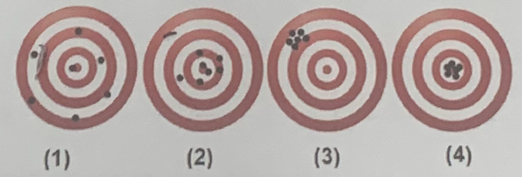

  <b>QUIZ 1 – Chapter 1</b> 
  Total time: 10 minutes

**Part I. (8 points) Multiple choice questions**

**Question 1:** If the matter is uniform throughout, cannot be separated into other substances by physical processes, but can be decomposed into other substances by chemical processes, it is called a (an) \_\_\_\_\_\_\_\_.  
A. heterogeneous mixture  
B. mixture of elements  
C. homogeneous mixture  
D. compound  

**Question 2:** Which of the following image(s) shows a high precision?  

A. (1) and (2)  
B. (2) and (3)  
C. (3) and (4)  
D. (4) and (1)  

**Question 3:** What is the scientific notation of 1234?  
A. 1.234 × 103  
B. 1.234 × 10-3  
C. 12.34 × 102  
D. 12.34 × 10-2  

**Question 4:** Which of the following numbers has three (03) significant numbers?  
A. 151.0  
B. 0.00150  
C. 0.15  
D. 0.015  

**Part II. (2 points) Long answer question**  
**Question 5:** What is the correct result (indicating the proper number of significant figures) of the following addition: (12 + 1.2 + 0.12 + 0.012)? Explain the result.
