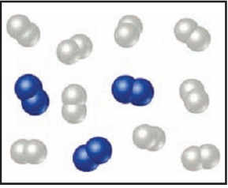
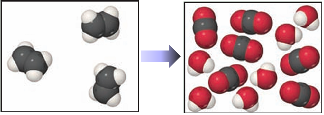

# CHM 1142 Chapter 3 Quiz 1

**Question 1:** Balance this equation by providing the missing coefficients:

$$\underline{\hspace{1cm}} \text{CaCO}_3(s) + \underline{\hspace{1cm}} \text{HCl}(aq) \rightarrow \underline{\hspace{1cm}} \text{CaCl}_2(aq) + \underline{\hspace{1cm}} \text{CO}_2(g) + \underline{\hspace{1cm}} \text{H}_2\text{O}(l)$$

**Question 2:** Balance this equation by providing the missing coefficients:

$$\underline{\hspace{1cm}} \text{Al}(s) + \underline{\hspace{1cm}} \text{HCl}(aq) \rightarrow \underline{\hspace{1cm}} \text{AlCl}_3(aq) + \underline{\hspace{1cm}} \text{H}_2(g)$$

**Question 3:** The white spheres are hydrogen atoms and the blue spheres are nitrogen atoms. The two reactants combine to form ammonia, $\text{NH}_3$.

**How many $\text{NH}_3$ molecules should be shown as the product?**  
A. 2  
B. 4  
C. 6  
D. 9  

**Question 4:** The white spheres are hydrogen atoms and the blue spheres are nitrogen atoms. The two reactants combine to form ammonia, $\text{NH}_3$. Write a balanced chemical equation for the reaction.

**Question 5:** Balance this equation by providing the missing coefficients:

$$\underline{\hspace{1cm}} \text{Fe}(s) + \underline{\hspace{1cm}} \text{O}_2(g) \rightarrow \underline{\hspace{1cm}} \text{Fe}_2\text{O}_3(s)$$

**Question 6:** The white spheres are hydrogen atoms, the black spheres are carbon atoms, and the red spheres are oxygen atoms. Write a balanced chemical equation for the reaction.

**Question 7:** Determine the number of $\text{O}_2$ molecules that should be shown in the left (reactants) box.

A. 9  
B. 12  
C. 18  
D. 32  

**Question 8:** The unbalanced equation for the reaction between methane and bromine is:

$$\underline{\hspace{1cm}} \text{CH}_4(g) + \underline{\hspace{1cm}} \text{Br}_2(l) \rightarrow \underline{\hspace{1cm}} \text{CBr}_4(s) + \underline{\hspace{1cm}} \text{HBr}(g)$$

**Once this equation is balanced what is the value of the coefficient in front of bromine $\text{Br}_2$?**
