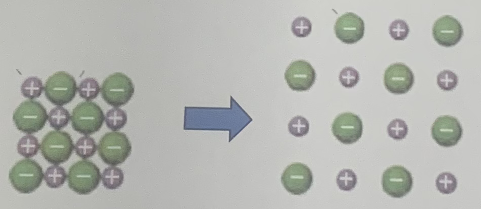
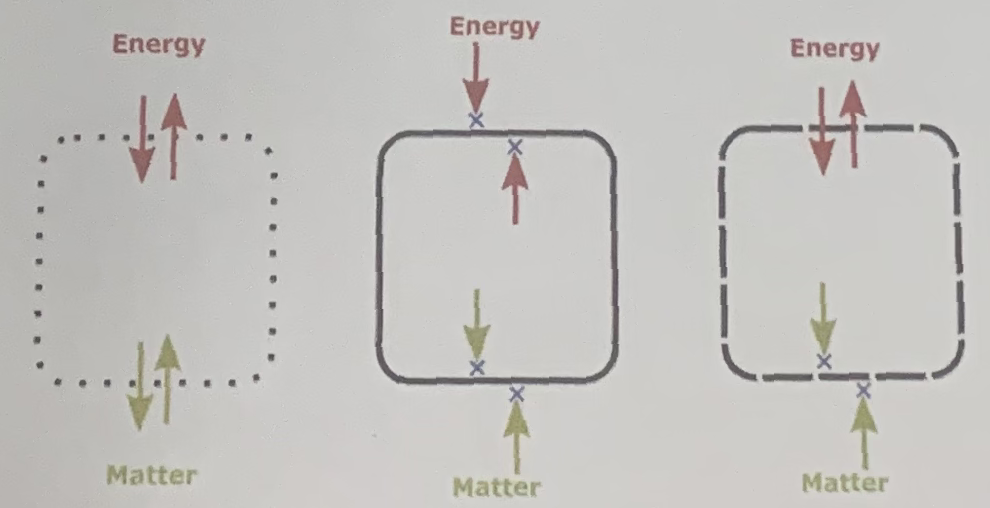

  
**QUIZ 7 – Chapter 5 Part 1**  
**Total time: 10 minutes**

### Part I. (8 points) Multiple choice questions

**Question 1:** Is the energy released or consumed in the following process?

* **A.** Released  
* **B.** Consumed  
* **C.** A and B  
* **D.** Neither A nor B  

**Question 2:** The following diagrams represent three systems in thermodynamics. What are they from left to right?

* **A.** Isolated, open, closed  
* **B.** Closed, open, isolated  
* **C.** Open, isolated, closed  
* **D.** Isolated, closed, open  

**Question 3:** A reaction under certain conditions has an enthalpy change of $\Delta H = -118 \text{ kJ}$. This means that $118 \text{ kJ}$ of heat would be liberated  
* **A.** if the reaction were carried out at constant pressure.  
* **B.** if the reaction were carried out at constant concentrations.  
* **C.** no matter how the reaction were carried out.  
* **D.** if the reaction were carried out at constant volume.  

**Question 4:** A gas at $25.00^\circ\text{C}$ and $0.47 \text{ atm}$ expands from $25.0 \text{ L}$ to $35.0 \text{ L}$. What is the value of the work done on or by the gas? ($1 \text{ L}\cdot\text{atm} = 101.325 \text{ J}$)
* **A.** $480 \text{ J}$
* **B.** $3600 \text{ J}$
* **C.** $-3600 \text{ J}$
* **D.** $-480 \text{ J}$

### Part II. (2 points) Long answer question

**Question 5:** When fuel is burned in a cylinder equipped with a piston, the volume expands from $0.255 \text{ L}$ to $1.45 \text{ L}$ against an external pressure of $1.02 \text{ atm}$. In addition, $875 \text{ J}$ is emitted as heat. What is the $\Delta E$? ($101.3 \text{ J} = 1 \text{ L}\cdot\text{atm}$)
