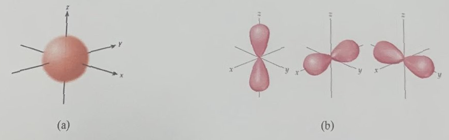

  
**QUIZ 8 – Chapter 6**  
**Total time: 10 minutes**

### Part I. (8 points) Multiple-choice questions

**Question 1:** The red line ($\lambda = 656.28 \text{ nm}$) in the hydrogen spectrum are due to transition from a level for which $n_i > 2$ to the $n_f = 2$ level. What is the value of $n_i$?
* **A.** 3
* **B.** 4
* **C.** 5
* **D.** 6

**Question 2:** What orbitals do the following shapes represent?

* **A.** $s$ and $f$
* **B.** $p$ and $d$
* **C.** $p$ and $f$
* **D.** $s$ and $p$

**Question 3:** According to the generalised formula stated by Bohr's model, we know the energy of an electron in an hydrogen atom in the ground state is $-13.6 \text{ eV}$. What will be its energy in the second excited state?
* **A.** $5.6 \text{ eV}$
* **B.** $-1.51 \text{ eV}$
* **C.** $-2.35 \text{ eV}$
* **D.** $-3.4 \text{ eV}$

**Question 4:** The following diagram shows an atom at its ground state.  
[↑↓] [↑↓] [↑↓] [↑↓] [  ]  

* **A.** True
* **B.** False

### Part II. (2 points) Long-answer question

**Question 5:** Write the full and shortened electron configurations of $\text{Cr}$, $\text{Cr}^{+3}$, and $\text{Cr}^{+6}$. No explanation is required.

| Atom/Ion | Full electron configuration | Shortened electron configurations |
| :--- | :--- | :--- |
| **Cr** | | |
| **Cr⁺³** | | |
| **Cr⁺⁶** | | |
