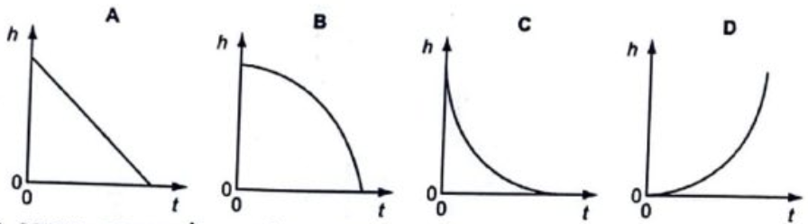
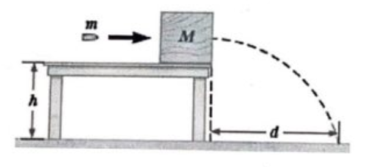

**Student's full name:** ........................................................................ **Troy ID:**.........................................

**Q1:** Which formula could be correct for the speed $v$ of ocean waves in terms of the mass density $\rho$ of sea water, the acceleration of free fall $g$, the depth $h$ of the ocean and the wavelength $\lambda$?  
A. $v = \sqrt{g\lambda}$  
B. $v = \sqrt{g/h}$  
C. $v = \sqrt{\rho g h}$  
D. $v = \sqrt{\rho/g}$  

**Q2:** Which of the following gives the correct units for kinetic energy?  
A. $kg.m/s^2$  
B. $kg.m^2/s^2$  
C. $kg.m^2/s$  
D. $kg/m.s^2$  

**Q3:** A small steel ball falls freely under gravity after being released from rest. Which graph best represents the variation of the height $h$ of the ball with time $t$?

**Q4:** A micrometer screw gauge is used to measure the diameter of a copper wire. The reading with the wire in position is shown in diagram 1. The wire is removed and the jaws of the micrometer are closed. The new reading is shown in diagram 2.  
What is the diameter $d$ of the wire?

**Answer:** $d = ...................... (mm)$

**Q5:** The momentum of an object changes from $150 \text{ kg.m/s}$ to $250 \text{ kg.m/s}$ in $2 \text{ seconds}$. What is the mean resultant force on the object during the change?

**Answer:** $force = ................... (N)$

**Q6:** A train is running in a straight line at a speed of $22 \text{ m/s}$ when the driver applies the brakes, creating an acceleration of $2.0 \text{ m/s}^2$ during the train's motion. How far does the train move until it stops?

**Answer:** $d = ....................... (m)$

**Writing section:** Ex.6.40

