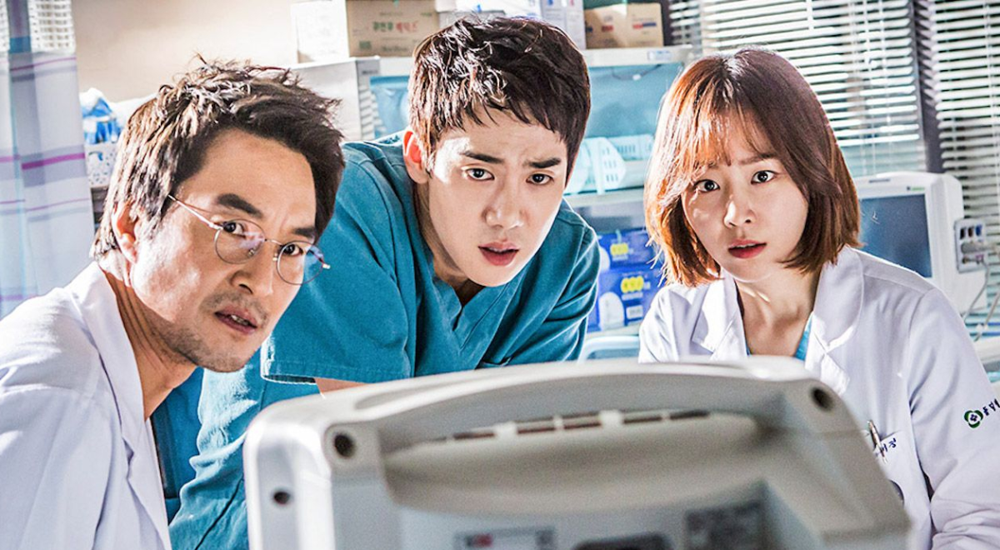

# special appendix, personal story: from heartbreaking to healing.

[Notion](https://pinto-relish-15a.notion.site/special-appendix-personal-story-from-heartbreaking-to-healing-22fd9622fa1980459afdccff2265ad52)

Chà, cái lúc tôi viết phần nhỏ này thì cũng là lúc tôi chính thức xong hoàn toàn công việc ở lớp đại học, tức là đã thi xong hết và chỉ cần chờ làm một chút thủ tục để ra trường. Tôi ít nhiều cũng có thể tự hào là các mục tiêu ở đại học, có thể nói là hoàn thành, dù chúng không thực sự hoàn hảo. 6 năm, tính từ lúc tôi vào lớp 10, cho đến hết 2024, có lẽ là khoảng thời gian buồn và đau nhất trong cuộc đời, phần nào hằn lên tôi những suy nghĩ, lo lắng, sợ hãi và cô đơn khi phải liên tiếp đối diện với những tan vỡ trong cuộc đời của mình. Dẫu vậy, trong cái khoảng thời gian buồn ấy, tôi vẫn có chút may mắn khi được làm việc trong một tập thể mà ít nhiều cùng chia sẻ những nỗi đau và lo lắng ấy. Cái ý tưởng cá nhân này xuất phát từ việc cái repository của tôi cần một câu chuyện mang tính cá nhân, nhiều hy vọng và lý tưởng, so với cái introduction còn quá chung chung. Tại đây, tôi muốn giải thích những quyết định của tôi trong việc đối diện với những khó khăn của đại học và những gì tôi có được trong những trải nghiệm đầy khó khăn nhưng đáng nhớ ấy.

Đến cuối cùng, tôi lại về cái hành trình mà tôi phải đi đường vòng để quay lại, 6 năm rồi. Tuy nhiên, tôi luôn biết ơn khoảng thời gian đại học này dù nó không thể hoàn hảo được khi hầu hết thời gian, tôi giải quyết vấn đề cá nhân hơn là làm tốt những việc mình muốn làm dưới tư cách lớp trưởng.

Tôi sẽ kể cái sự thay đổi ấy bằng nhiều phương diện khác nhau để đúng với ý tưởng của nó:

> ***từ tan vỡ đến chữa lành.***
> 

Alright, enough intro, start!!!!

## i. how i entered???

> **tôi không bắt đầu từ niềm vui, tôi bắt đầu bằng sự tan vỡ và trốn chạy khỏi nó…**
> 

Câu chuyện bắt đầu khi tôi đỗ đại học, theo đúng như kế hoạch tôi đề ra và phải rất cố gắng mới được chấp thuận, là vào Troy. Trên thực tế, với phổ điểm như vậy, tôi chỉ có thể cố gắng vào các chương trình quốc tế vì chúng có yêu cầu ngoại ngữ - vốn là yêu cầu mà tôi có thể đáp ứng được, thêm cả việc các chương trình chuẩn có điểm đầu vào khá cao mà với cái khả năng học của tôi thì có mơ cũng chẳng thể vào được, vì nó khó hơn lên trời. Tóm lại, tôi không mong chờ việc vào được chương trình gì quá nhiều vì tôi cũng phần nào vỡ mộng khi nhiều ý tưởng học tập của tôi không được thực hiện, biết trước chuyện trượt môn và hơn hết, tôi chỉ cần một cái nơi để bảo vệ chút thể diện rồi tiếp tục con đường học tập của mình. Thực sự rất khó để thuyết phục gia đình khi đây là lần đầu tôi học chương trình quốc tế vì chi phí học tập khá đắt đỏ, cũng như hoài nghi từ phía gia đình rằng liệu tôi có theo kịp được chương trình học hay không. Mọi nghi ngờ được gạt sang một bên khi đến kì đầu của tôi có kết quả không tệ. 

Trong khoảng thời gian chờ điểm và vấn đề chuyên môn trong học tập lại không phải vấn đề chính. Trên hết là, từ sự vỡ mộng của bản thân về tương lai, tôi có một cảm giác là mình phải chuẩn bị trước cho những điều phải đến, vì thế tôi bắt đầu học các ngôn ngữ lập trình cơ bản như C#, Python và JS. Dù tôi học không sâu lắm, nhưng nhờ việc chuẩn bị trước tài liệu, cái lúc tôi vào học lại có phần dễ theo kịp. Chuyện trượt môn, tôi cũng phần nào được báo trước, thế nên tôi càng chuẩn bị tâm thế kĩ càng hơn ngày trước như thức dậy sớm, làm bài tập đầy đủ, sống có trách nhiệm… Nói chung, tôi chuẩn bị vấn đề học tập cũng là tốt nhất có thể vì tôi chẳng biết mình có thể trụ được bao lâu với một cái tâm lý còn nhiều vết xước như thế.

Còn về chuyện tập thể lớp, tôi không đặt quá nhiều niềm tin rằng họ sẽ đối tốt với mình hay trở thành thiên thần, nó cũng đơn giản vì tôi tan nát cõi lòng khi ý tưởng của tôi không được lắng nghe. Thế nhưng, may mắn cho tôi là tôi gặp một tập thể lớp mà tôi không nghĩ rằng họ sẽ thay đổi suy nghĩ của tôi nhiều đến thế. Họ không ghét tôi khi tôi nói quá nhiều mà họ chủ động làm bạn với tôi, nó vượt xa cái suy nghĩ ban đầu của tôi là “**ừ, đại học mà, thằng nào cũng tồi hết, đéo ai đáng tin cả**”. Thực tế thì khi đi đủ dài với họ, dù tôi và họ có nhiều quan điểm khác nhau nhưng ít nhiều giữa tôi và cả lớp có sự tôn trọng nhất định về những vấn đề của nhau và niềm tin chúng tôi được tạo dựng nhiều bằng sự cảm thông, chia sẻ và quyết đoán trong các quyết định quan trọng của lớp. Ngồi nghĩ lại, tôi nghĩ là dù khoảng thời gian học đại học của tôi cơ cực và tan nát tới đâu, ít nhiều tôi thấy biết ơn vì có một tập thể chấp nhận những điều tệ hại từ tôi và cho tôi một cơ hội để sửa sai. Dẫu vậy ở thời điểm đầu, tôi còn khá non nớt nhưng tôi làm việc khá hòa nhập với lớp và tiếp thu một vài nền văn hóa mà tôi đã không thể làm khi mải miết thi cử. 

Cuối cùng, mục tiêu bắt đầu của tôi khi vào đại học ấy, là một câu hỏi lớn trong đời mà tôi phải trả lời:

> **tôi là ai???? 
ý nghĩa của tôi là gì???**
> 

Đó là mục tiêu âm thầm nhất trong mỗi việc tôi làm ở đại học, tôi muốn tìm lại cái giá trị của bản thân khi tôi đã đánh mất trong 3 năm. Đến với một môi trường mới với một tâm lý hằn sâu những vết xước, tôi không biết phải định nghĩa bản thân như thế nào để có thể vượt qua những khoảng thời gian ấy. Tôi muốn khi kết thúc đại học, phải rút hồ sơ trong danh dự và tìm kiếm lại ý nghĩa của bản thân thông qua một quá trình dài ấy. Cũng có thể nói rằng tôi đi tìm kiếm lại ước mơ của chính mình và niềm tin với tất cả mọi thứ xung quanh. Dẫu vậy, cái hành trình ấy không thực sự dễ dàng như tôi vẫn nghĩ, nhưng tôi đã chấp nhận đi vào nó, một thế giới mà tôi không biết trước kết cục ra sao, vui hay buồn, hạnh phúc hay tan nát….

Khởi đầu thì không có gì nhiều lắm, chỉ là nếu xét trên phương diện học tập thì nó vẫn đẹp so với năm 2018 - cái thời điểm thi cấp III mà khiến tôi gặp trầm cảm. Tôi thấy là, dù nó khó khăn, nhưng cái tốt nhất là khi tôi không ép bản thân mình mong đợi gì quá nhiều mà có một cơ hội để sửa chữa những gì cần phải sửa chữa - vẫn là may mắn hơn khi tôi còn chả có chút cơ hội nào.

a fresh start, huh????

## ii. first incidents, clashes, ego.

> vết thương cũ chưa kịp lành, vết thương mới lại rỉ máu.
> 

---

  
the second semester: something to come….

Khoảng thời gian này nằm ở cuối kì I và tiếp diễn tới kì thứ VI, đó là thời điểm hết dịch và tôi chuyển lên thành phố để học tập. Tuy nhiên, trước đó, tôi có một giai đoạn mà khiến tôi dần không vui về sau, đó là chuyện tôi trượt bằng lái xe tới 3 lần. Lần đầu trượt bằng lái cũng là lúc tôi phải nghỉ buổi học Toán đầu tiên, vốn là việc tôi rất kiêng kị vì nếu mất một buổi điểm danh thì kết quả học tập của tôi cũng sẽ bị ảnh hưởng, và đúng là như thế. Cái con số 89 đầy ám ảnh khiến tôi không thể nào học một cách bình thường như tôi muốn. Cả nhà căng thẳng, cãi nhau và đó cũng là lúc tôi cảm nhận sự căng thẳng ngay trong chính gia đình của mình. Cái giá của việc trượt một cái gì đó khiến tôi tỉnh ngộ và phải chuẩn bị nước đi sau này, dĩ nhiên là sau này, khi việc trượt một cái gì đó không khiến tôi bị ám ảnh như trước, thì có lẽ, tôi có thể nhìn nhận mọi thứ nhẹ nhàng hơn như bây giờ, cái lúc tôi đang viết ấy. Tuy nhiên, tại cái thời điểm bắt đầu ấy, mọi thứ rất căng thẳng với tôi, ngay cả việc học cũng không thể đàng hoàng vì trong đầu tôi vẫn oang oảng cái cằn nhằn của gia đình chuyện bằng lái. Mầm mống của chuỗi ngày tệ hại xuất hiện ngay trong đầu tôi như vậy đấy…

Cái lúc tôi lên thành phố học ấy, nó là một chuỗi ngày kinh khủng nhất mà tôi sẽ không bao giờ quên trong quá trình trưởng thành. Hết dịch, một đống sinh viên từ các tỉnh đổ xô về thành phố học khiến tình trạng giao thông ở thành phố cũng như tình trạng dân cư trở nên quá tải. Lên thành phố ấy, nó vừa mệt và rã rời, gần như tôi không háo hức cho lắm vì đáng lẽ cái lúc tôi có thể vui vẻ được, giờ chỉ toàn là mây mù và sự khó đoán của tương lai. Tôi trọ đầu tiên ở Quan Nhân, cái ngõ của tôi trọ thì hẹp khủng khiếp, ra bờ sông Tô Lịch thì chỉ thấy mùi nồng nặc từ cống, giao thông thì liên tục tắc nghẽn và những ngôi nhà san sát nhau, hẹp như khe Young ấy (cái khe hẹp mà cho ánh sáng đi qua ấy, dùng trong vật lý quang học). Do việc chọn trọ rất vội vã nên tôi cũng chỉ có thể cố gắng thu dọn đồ đạc nhanh nhất có thể, mang rất nhiều sách từ nhà và có ý định sẽ đọc. Cái căn trọ thì tôi không biết miêu tả như thế nào, nhưng nó tệ hơn tôi nghĩ rất nhiều, chỉ có mỗi cái phòng của tôi thì cố gắng sạch nhất có thể nhưng vẫn không thể che giấu đi cái mùi. Thực lòng thì tôi không để ý nhiều đến những chi tiết ấy mà phải về sau, cái lúc mà tôi buộc phải chuyển đi, thì những chi tiết này dần được để ý.

Trải nghiệm đi học và sống ở kì II là chuỗi ngày lấy đi năng lượng của tôi. Ngay tại bãi đỗ xe gần đấy, cái việc để chéo lối đi và ép vào trong hầm là một điều dại dột nhất mà đám xây dựng trọ cũng như chủ trọ nghĩ ra. Một căn hẻm mà gần 50 cái xe san sát vào nhau không một thứ tự, với một cái dốc chỉ để kéo xe lên, cái cửa thì ngay sát cái lối vào và đường ngõ cũng hẹp y chang. Bài tập buổi sáng của tôi không phải là đi ăn, mà là phải dọn bãi đỗ xe từ sáng sớm, mất từ 15-30 phút trung bình tới 1 tiếng. Đường xe ở thành phố khó để miêu tả, có 4 cây số thôi mà mất cả gần tiếng đồng hồ mới tới được trường, chờ đèn đỏ thì rất lâu, xe thì chen chúc nhau chẳng thấy lối đi, người đi xe máy thì chèn luôn vào vỉa hè. Đi đường chỉ ngửi thấy mùi sông nồng nặc tận mũi của mình. Khi đến trường, tôi cũng hoàn toàn rệu rã và mệt mỏi, cái cảnh tượng của tôi khi ấy không khác gì một cậu trai vừa mới ngủ dậy, cái quần áo thì giống như chưa giặt với tắm, đôi mắt cứ lờ đờ, mặt tôi cứ hóp lại, không khác gì một thằng nghiện. Càng học, tôi chìm nghỉm trong những môn học mà, không phải vì môn học ấy chán, mà là tôi đã quá rệu rã và mệt mỏi để học một môn học cần rất nhiều năng lượng và sự tập trung. Cái khổ hơn là, càng học, tôi lại càng rệu rã và cứ thế, tôi trượt dài trong chán nản và không còn nhiều thời gian cho bản thân để học một cách đàng hoàng.

Tiếp đến, mọi thứ ở trọ cũng chẳng tốt đẹp hơn là bao. Cái phòng trọ lộn xộn ấy khiến tôi mệt mỏi và rã rời, có khi còn mệt hơn cả đi làm. Tôi về trọ, nhưng thay vì tự do nấu ăn và suy nghĩ, tôi lại chọn cách nằm bệt ra giường và cứ như thế trong suốt một ngày, chỉ khi nào ăn thì tôi mới dậy. Bản thân cái phòng trọ tôi cũng u tối theo kiểu không có chút ánh sáng bên ngoài, tôi chỉ có thể nhìn thấy chút ánh sáng từ khe cửa bên ngoài với một tấm thân rệu rã. Trong suốt khoảng thời gian đấy, tôi dần mất đi năng lượng khi luôn cảm thấy mệt mỏi, liên tục thức khuya và biếng ăn một cách đột ngột. Mâu thuẫn trong sinh hoạt cũng đẩy lên rất cao khi tôi ở chung với những người tôi không thực sự tin tưởng và tôi cũng không dám biểu đạt những ý kiến và kế hoạch riêng chỉ vì tôi sợ rằng tôi lại làm mất lòng gia đình mình thêm một lần nữa. Cứ như vậy, tôi mất dần quền chủ động trong cuộc sống theo những cách như vậy đấy, khi người ta vốn chẳng bảo vệ tôi nhưng lại muốn tôi phải chấp nhất tin họ (điều này sẽ được chứng minh về sau khi tôi buộc phải chuyển trọ trong bất ngờ). Cái dấu hiệu khủng khiếp hơn nữa là việc tôi bắt đầu tiêu xài tiền vô tội vạ, dù cho tôi thực sự không muốn. Mỗi một ngày, chi tiêu của tôi lên tới hàng trăm nghìn cho một ngày mà tôi không có cách nào để tự kiểm soát chi tiêu cho riêng mình. Chi tiêu vô độ và chủ nghĩa tiêu thụ tàn phá họ bằng việc biến những hoạt động thường nhật như ăn uống, vui chơi trở thành những thứ mà người ta phải đắn đo từng chút một. Chỉ trong 1 tuần ngắn ngủi mà con số tiền tôi tiêu chắc phải lên tới 200-300 nghìn trên một tháng và tôi rất xấu hổ khi cứ liên tục xin tiền vô tội vạ vì không thể nghĩ ra cách nào khác để quản lý tài chính, dù tôi đã rất cố gắng rồi. 

Và, chuyện gia đình, vốn là một đề tài nhạy cảm trong suy nghĩ của tôi thì đến giờ, tôi có lẽ không thể chối bỏ dù đã rất cố gắng tỏ ra như không có gì. Do đã đánh mất niềm tin từ gia đình, kèm theo việc chọn một chương trình học mà tài chính quá lớn, tôi và gia đình liên tục có xung đột, đặc biệt là chuyện tài chính cũng như cái cách đối diện vấn đề. Gần như mỗi khi tôi về nhà, thay vì tôi vui vẻ và cảm thấy được nghỉ ngơi sau một tuần học dài đằng đẵng, tôi đối diện với sự căng thẳng ngay trong gia đình của mình, những mâu thuẫn chồng chất từ năm này qua năm khác mà trong bữa cơm cứ liên tục khơi ra khiến tôi không có tâm trạng để ăn uống. Rồi mẹ tôi cũng hối hả với guồng công việc của mình và bà ấy liên tục căng thẳng khi cứ phải nghĩ đến những vấn đề xung quanh. Còn tôi, tôi vẫn bị đè nén bởi những vấn đề mà tưởng rằng tôi đã đi qua và không nghĩ về nữa. Thật khó để chia sẻ với gia đình của mình, một mình tôi ôm lấy những khó nhọc về tâm lý, những nỗi đau mà không biết phải kể cho ai nghe và niềm vui bỗng chốc trở thành nỗi cực hình mà tôi phải gánh. Gia đình khi ấy với tôi không thực sự đẹp như tôi mong và nhiều lúc, tôi chỉ muốn một mình và ngồi khóc ở đâu đó, thực sự tôi mệt và rã rời đến phát điên rồi.

Để nói thì tôi quá non nớt để nhìn nhận ra sự thật rằng, có lẽ lên đại học không vui như tôi vẫn nghĩ, cũng như việc tôi không nhìn ra rằng có những vấn đề không thể cứ lên đại học hay là để ngâm nó đi thì nó sẽ qua. Có một sự thật mà sau này tôi mới biết là…. những vấn đề ấy vẫn còn đó, nó vẫn là một phần âm ỉ mà tôi chưa bao giờ một lần nhìn lại và đối diện đàng hoàng, thậm chí, chính những vấn đề gia đình đã cướp đi động lực và niềm tin học tập mà tôi cố gắng tạo dựng với bản thân. Mọi sự trồi sụt giờ mới chỉ là bắt đầu…

  
the third semester: broken…

Kì hè của tôi bắt đầu vào cuối tháng 6, đầu tháng 7, trong cái nóng bức của mùa hạ. Cái mâu thuẫn giữa tôi và người khác trong trọ cũng dần tăng lên. Những bất đồng trong phương thức sinh hoạt, sự phụ thuộc cũng như tình trạng trọ sau đó khiến tôi phải lên trước kế hoạch di tản. Tiền trọ lên tới 2 triệu cho một căn phòng tồi tàn, đường đi chật hẹp, ô nhiễm và bẩn thỉu đến mức không thể dọn khiến tôi không thể chịu đựng thêm. Kế hoạch chuyển trọ đấy bao gồm cả việc thi IELTS mà tôi đã lên từ tháng 6/2022, vốn là mở đầu cho toàn bộ kế hoạch về sau. Cái lý do rõ nhất cho việc thi IELTS là tôi muốn đúng thời điểm học, vì nếu nộp muộn sau kì IV thì sẽ bị đội thời gian lên do bảo lưu. Tôi đánh giá là khoảng thời gian tôi học IELTS cũng rất vội và gần như không chuẩn bị tâm lý tốt, mặc dù kết quả thi cũng không tệ - 6.5 cho 2 tháng học và 2 tuần ôn gấp. Dĩ nhiên, chuyện gì tới cũng phải tới….

Cái thời điểm tôi buộc phải chuyển trọ cũng là sát nút đi học, tầm đầu đến giữa tháng 7, tổng thời gian từ lúc nhận thông báo tới lúc chính thức xong việc là 2 tuần. Mặc dù, việc chuyển trọ của tôi đã thành công, nhưng nó cũng khiến tôi nhận ra là có rất nhiều vấn đề nghiêm trọng từ tôi mà đến sau này, tôi cảm thấy vô cùng có lỗi với bạn mình khi không thể bảo vệ khỏi những vấn đề của chính tôi. Nhờ có hai người bạn, một người là bạn thân từ hồi cấp II, và một người là bạn cùng trọ cuối cùng của tôi về sau, mà tôi đã trở nên tự giác hơn trong vấn đề trọ. Cái họ dạy tôi là tôi nên có trách nhiệm với những vấn đề của bản thân và suy nghĩ một cách nghiêm túc, dù thực sự rất vất vả. Có điều, khi chuyện tôi tìm trọ tới tai gia đình tôi, gia đình tôi nổi đóa lên vì sợ làm mất lòng người khác và dồn tôi tới trạng thái khó xử. Mãi về sau, mẹ tôi cũng xuôi vì biết rõ rằng ngoài tôi tự đi tìm trọ, chắc họ cũng không thể can thiệp được và cũng từ đó, họ tạm chấp nhận, mặc dù không hề ưa gì người bạn cùng trọ của tôi (để tôn trọng, tôi xin không nhắc tên). Việc cha tôi can thiệp quá sâu và luôn tỏ ra không hài lòng mặc dù chính ổng là người gây ra những khó khăn ấy khiến tôi thực sự rất mệt mỏi khi đối diện với gia đình của mình. Điều đó càng khiến tôi thu hẹp bản thân và suy nghĩ của mình lại, thậm chí là sống khép kín dần về sau.

Tưởng chừng mọi thứ cũng đã tốt hơn, nhưng tôi chính thức rơi vào trầm cảm một lần nữa, khi mà cái laptop của tôi bị hỏng trong vòng 4 tháng. Toàn bộ dự án, kế hoạch học tập và làm việc về sau của tôi cũng bị giam, khoản tiền 27 củ ấy bay trong thoáng chốc. Và cái chuyện ấy là cực hạn cho tất cả những mâu thuẫn đọng lại trong suốt mấy năm dài. Cứ khi về nhà, cái chuyện laptop bị lôi ra khiến tôi buồn càng thêm buồn. Tôi bắt đầu nhận ra mình bị trầm cảm thực sự và những vấn đề tâm lý ấy, tưởng như đã thoát ra rồi, nhưng nó vẫn ở đấy và càng lúc trở nên kinh khủng hơn. 3 năm trôi qua mà những mâu thuẫn ấy vẫn vậy… Trong một tuần, tôi gần như quên sạch kiến thức lập trình, đến việc gõ phím cũng không dám gõ và tôi chỉ khóc vì thực sự tan vỡ. Gần như, cái tự do đầu tiên tôi có lại tan biến theo cách như vậy đấy, những kế hoạch học tập dài hơi hơn cũng đã tan biến đi. Đúng lúc đó, tôi còn mới nhậm chức lớp trưởng, và biến cố này khiến tôi không thể truy cập được hòm thư của lớp, dẫn đến việc mọi người không nhận được thông tin cần thiết, chính điều này thay đổi cái cách tiếp cận công việc về sau khi tôi trải qua sự vỡ mộng khi cố đạt tham vọng cá nhân và hiểu ra những khó khăn của mọi người trong lớp. Gần như, dù tôi rất cố gắng học tập, nhưng tính từ lúc tôi bị trầm cảm ấy, gần như toàn bộ thời gian đại học của tôi là để giải quyết vấn đề cá nhân hơn là tập trung học tập một cái gì đấy, khi mà động lực học tập bị thế chỗ bằng nỗi sợ tương lai. Tôi lại rơi xuống vực thẳm một lần nữa, và càng cố gắng chống trả, cái mặc cảm tội lỗi và mất đi khả năng làm việc khiến tôi quên dần đi ý nghĩa của việc học và chìm sâu trong tham vọng cá nhân do nỗi sợ trượt môn và hụt thành tích. 

Một năm xui xẻo, tan nát và vỡ mộng tới trong chính trái tim tôi, kể từ kì 3. Khoảng thời gian ấy kéo dài đến hết đại học. Chưa lần nào mà tôi thấy bản thân tôi lại vỡ vụn nhiều và đau khổ nhiều vì vỡ mộng. Hóa ra, có một sự thật mà tôi không nhìn ra, rằng những đau khổ trong quá khứ vẫn không kịp lành lại và nỗi đau tới quá nhanh. 

Vô vị, xui xẻo, tan vỡ, 2022 của tôi đi như vậy đó.

  
from fourth to fifth: ambition from a broken heart…

Kể từ lúc tôi bị hỏng máy tính, từ kì 4 trở đi, gần như tôi không học lập trình gì mấy. Gần như, những tham vọng cá nhân và sự hắc hóa của tôi biểu hiện rất rõ trong giai đoạn này. Ở giai đoạn này, tôi vẫn cố gắng lết thân mình sống, dù rất yêu thương mọi người, nhưng đầu tôi chất chứa nhiều tham vọng và bị cuốn vào nó lúc nào chẳng hay. Vị ngọt của điểm A kinh khủng đến mức mà sau giai đoạn này, khi gặp phải kì 8 với thầy Kumar, tôi đánh mất luôn cái tâm lý của mình và phải mất một khoảng thời gian dài nữa mới tìm thấy động lực thực sự của việc học. Đúng, tôi may mắn khi có thành tích, nhưng xét đến cùng, nó là lời nguyền mà chính tôi đã hứa rằng sẽ phá bỏ, và việc thoát ra khỏi nó cũng đau đớn và mệt mỏi chẳng kém gì việc cố gắng tìm kiếm cái thành tích cá nhân. Đây là đoạn mở đầu, khi trái tim tan vỡ và cuộc sống khắc nghiệt đủ giết chết tinh thần của một người như thế nào.

Trong khoảng thời gian 4 tháng cuối năm 2022, như tôi nói, tôi và bạn tôi chuyển trọ rất vội vã, nếu không muốn nói là chúng tôi không có thời gian để suy nghĩ là nên học như thế nào. Tháng 8, tôi trải qua một đợt sốc tâm lý nặng sau vụ hỏng máy tính và toàn bộ kiến thức lập trình cứ thế biến mất trong đầu tôi. Gần như là, toàn bộ thời gian tôi học trên lớp, tôi không có chút sức lực tinh thần nào, vì nó chán òm như cái thân còm tôi ấy. Đi khoảng 4 cây số, dậy sớm và lại phải dọn xe một lần nữa, tôi không có thời gian cho một bữa ăn, hay một tô mì đàng hoàng. Mỗi lúc học trên trường giống như một ngày dài, mệt mỏi và khó chịu. Khi sức lực chẳng còn, việc học dần trở thành một ác mộng. Giống như mọi khi, tôi vẫn làm lớp trưởng, vẫn cố gắng nhất có thể trong công việc khi học cách chào hỏi, giao tiếp với mọi người, nhưng sau đó, thay vì tôi chú tâm học, tôi lại lăn ra ngủ gật ở trong lớp và chỉ dậy khi có điểm danh. Về trọ, khoảng thời gian ban đầu, tôi cố gắng nấu ăn cùng bạn mình, cũng cố gắng dọn dẹp, nhưng tệ là, càng dọn thì càng bẩn. Đi học trên trường đã là một ác mộng, anh bạn thân của tôi cũng mệt mỏi rã rời nên gần như, dù ba người chúng tôi vẫn ở trọ nhưng nói chuyện với nhau thì ít dần đi, chỉ khi nào đóng tiền trọ mới báo nhau. Dẫu vậy, gần như ba người cố gắng tôn trọng nhau nhất có thể, đơn giản là học trên trường đã mệt và thêm cả việc xử lý bất đồng nữa, thì chắc có lẽ sẽ chỉ tốn thời gian lẫn sức lực của cả ba. Ít ra, tôi vẫn cố gắng cầm cự và sinh tồn, khác với việc cứ thoi thóp mãi, dù tôi biết cái lựa chọn ấy sẽ rất gian nan, nhưng tôi cũng cảm nhận là mình đang cố gắng sống. Càng về sau, khi mà trọ trở nên không thể dọn được nữa, và mâu thuẫn gia đình càng tăng lên, tôi cũng dần hiểu ra cái cuộc sống này không cho tôi nhiều lựa chọn, mà gần như, tôi dành thời gian giải quyết mâu thuẫn cá nhân nhiều hơn đi học. Tệ hơn, tôi bắt đầu thiếu lành mạnh dần, hay thức khuya, ít ăn uống, dẫn đến cái sức lực kém, cân nặng sụt hơn 15kg chỉ sau 1 năm đi học. Thậm chí, cái hình ảnh tôi xem lại ấy, nó nghiện, nó mệt mỏi và khó chịu như phải cố cầm cự ấy. Tôi vẫn làm bài tập đầy đủ, nhưng tiếc là, tôi lại không hứng thú với việc học như ngày trước. Mọi thứ thực sự khó khăn, cả tài chính cũng dần eo hẹp khiến tôi mệt lả dần. Tôi đánh mất bản thân và chỉ sống như một tù nhân, nhưng ít nhất, tôi có vài người bạn mà tôi có thể chia sẻ khó khăn và dám nói thẳng những cái khó của mình, để sau này, tôi không phải cảm thấy bị dồn nén nhiều. Việc làm lớp trưởng của tôi cũng vậy, tôi tuy mệt mỏi nhưng cũng dần cố gắng giao tiếp với mọi người, không nhất thiết phải nói nhiều nhưng tôi cũng quyết định đưa ra một vài lựa chọn, đó là tạo ra hệ thống chuyển tiếp mail để tránh áp lực cho bản thân, cũng như tự động hóa việc chuyển thông tin cho lớp. Nỗ lực ấy tuy không đáng kể, nhưng ít ra tôi cũng không hổ thẹn nhiều vì tôi phải làm như thế khi tôi không có đủ sức lực. Nói như vậy không có nghĩa là mọi thứ đều đen đủi, cũng có điểm sáng ở cuối con đường mà…

Trước kì V, tôi nhận được kết quả thi các môn, tôi được 2 điểm A, bao gồm Lượng giác và Vật lý, tôi không biết có phải do tôi may mắn hay là thực lực, nhưng tôi thấy may mắn nhiều hơn, vì với cái thể lực dần rệu rã của tôi, việc đạt hai môn như thế là ảo diệu. Như một lẽ tất yếu, tôi tất tay cho các môn Toán, đặt tham vọng vào đó, và cũng là điểm yếu của tôi, đó là để tham vọng đi quá xa. Sau này, tôi mới hiểu là, ừ, cái điểm A ấy, cũng chỉ là thoáng chốc thôi, nhưng tôi đã quá mong chờ rằng nó sẽ là vùng an toàn và mọi vấn đề sẽ chẳng có gì. Dẫu vậy, đây cũng đánh dấu tiếp khi tôi lại chuyển trọ, lần này là vì người bạn thân của tôi đã quyết định không ở trọ do mắc bệnh. Việc chuyển trọ cũng diễn ra trong vội vã, sát nút kì mới nên chúng tôi không có thời gian để xem xét cái trọ nào tốt hơn cái nào. Thế là, một căn trọ có cửa sổ, diện tích hẹp hơn ở Bạch Mai là lựa chọn tốt nhất mà tôi có. Ban đầu, gia đình tôi phản đối kịch liệt nhưng về sau cũng chấp nhận vì đó là việc của hai chúng tôi và chúng tôi đã rất tự giác rồi. Giống như mọi lần chuyển trọ, đều có tiếng cãi vã và tôi lại không thể bảo vệ bạn mình. Dù sao thì, kiếm được một chỗ như vậy gần HUST là một điều may mắn, vì sẽ chẳng có chỗ nào với cái giá tốt hơn thế. Hơn nữa, điều may mắn của kì V là khi máy tính của tôi sống lại, tôi bắt đầu viết nhật kí và tiết lộ những chi tiết mà tôi che giấu trong nhiều năm. Kì tích làm sao khi 4 tháng chết máy, tôi gần như không được tiếp cận với tài liệu của mình, việc viết nhật kí của tôi cũng bắt đầu, ngoài việc tiết lộ những thứ tôi chưa từng nói trước kia, cũng như việc tôi muốn viết về những suy nghĩ hiện tại và lên kế hoạch cho tương lai. Kì 5 thì tôi vẫn cố gắng học, chỉ là khi có điểm A thì tôi cố gắng học hơn một chút, tôi làm bài tập đầy đủ hơn và cũng cố gắng thực hiện giờ giấc, vẫn cố gắng sinh tồn như mọi ngày, dù biết cái lúc tôi về trọ ấy cũng sẽ rất mệt mỏi và khó chịu, đơn giản là tôi chỉ tiếp tục sinh tồn, không phải là đang sống…

Kết thúc kì 5, tôi cũng cảm thấy may mắn khi có thành tích, cũng như việc tôi và bạn tôi chuyển trọ gần trường, tôi cũng quen được với môi trường học tập khắc nghiệt. Tuy nhiên, mọi niềm vui cũng ngắn, kì 6 lại tới và đây có thể nói là kì học nặng và hao tổn sức lực nhất, kì 8 và 10 chỉ xếp sau. Thời điểm kì V, khi tham vọng đang thực hiện và tôi nghĩ là nó ổn, tôi hoàn toàn chưa cảm nhận được sự bất ổn, hoàn toàn không, chỉ vì điểm A quá dễ dàng và tôi trở nên tham lam. Ngoài mặt, tôi vẫn thân thiện, nhưng bên trong của tôi đã nhuốm một chút màu của tham vọng điểm số mà tôi đã hứa sẽ chống lại. Dấu hiệu tự mãn, đố kị trong lòng tôi nó âm thầm lắm, cái cảm giác không làm được cái gì mà người ta lại làm được khiến tôi lại tự tạo thêm những áp lực không hay cho mình, bây giờ, tôi cũng đối diện với cảm xúc như vậy nhưng khác với bây giờ, thời điểm trước đó thì tôi lại không coi trọng suy nghĩ của bản thân nhiều mà dồn hết cho thành tích và thứ bên ngoài nhiều hơn là bên trong. Tôi cứ học điên cuồng mà nhiều khi không nhận ra là bản thân cũng cần được nghỉ ngơi và nhìn lại những gì mình đi qua. Well, có lẽ, chính cái tôi quá lớn, chủ quan và tự mãn dần giết tôi trong âm thầm và tôi đã phải trả giá ở kì hè sau đó - kì VI. Hơn hết, ít nhất thì, tôi không quá ác để trở thành người xấu, chỉ là tôi đang cố gắng trải nghiệm để hiểu cái lời thề đầu tiên mình từng nói và lý do tại sao phải cố gắng. Có lẽ, là tôi phải trải qua cái tham vọng của cá nhân, sự đố kị mà bản thân giăng ra và đạt chút điểm số rồi coi đó là vinh quang, khi tôi tự đi lên mây xanh và đến một mức nào đó, rồi sớm thôi, tôi lại vỡ mộng và chẳng biết sẽ vỡ lúc nào. Tóm lại là, tôi vui vì tôi có điểm số tốt, chứ không phải là tôi có lương tâm. Tôi thỏa mãn được cái nỗi sợ của mình hơn là dám đối diện với nó và tôi đã chìm trong tự mãn như thế ấy.

Đó là những gì xảy ra trước kì VI - khi mà tôi dần trở nên hắc hóa sau nỗi sợ và tìm kiếm chút thành tích chỉ vì cái nỗi sợ full B. Đó là khoảng thời gian mà tôi thấy bản thân mình sinh tồn rất tốt, nhưng cũng chìm dần sâu vào sự tự mãn và cái vùng an toàn mà mình nghĩ là sẽ tồn tại đủ lâu, cho đến khi mọi thứ dần vỡ vụn…

## iii. searching for reason why.

> one, two, three
> 
> -----
> got a lot of talk in my brain right now
> 
> sorry, gotta do it, gotta let you down
> 
> everything's hard to explain out loud
> 
> sorry, gotta do it, gotta let you down
>
> 'cause i don't really know who i am right now
> 
> no, i don't really know who i am right now
>
> -----
> 
> i feel pressure from the people that i love and it hurts
> 
> but i know i gotta do it, gotta put me first
> 
> i'm losing myself tryna make you proud
> 
> sorry, gotta do it, gotta let you down
> 
> 'cause i don't really know who i am right now
> 
> no, i don't really know who i am right now
>
> -----
>
> and it broke my heart when i cancelled tour
> 
> hurt my soul and my head going back and forth (ooh)
> 
> and i don't know how i'm gonna face you now
> 
> sorry, gotta do it, gotta let you down (ooh)
> 
> 'cause i don't really know who i am right now
> 
> no, i don't understand who i am right now
>
> -----
>
> so i bought a new place in a warmer town
> 
> no, i don't really know who i am right now
> 
>
> Shawn Mendes - “Who I Am” - Track 1 from “Shawn”
> 

Ở kì IV và V, khi nỗi sợ khiến tôi tạo ra vùng an toàn và tự mãn trong cái vùng an toàn đó, trái tim tôi hắc hóa từng chút một. Mục tiêu khi ấy của tôi là điểm số, trên hết là điểm số và mọi nỗ lực của tôi nhìn nhận bằng điểm số nhiều hơn là mình làm được gì. Có thể nói, kì V là một kì mà học tập của tôi gọi là đỏ, nhưng có lẽ tôi đã quên một điều là…. tôi đến để học, không phải vì thành tích. Cái thời điểm mà kì V, khi tôi chìm sâu trong vùng an toàn, tôi từng nghĩ là mọi thứ sẽ mãi như vây, thì đến kì VI, khi vùng an toàn không còn nữa, cái tệ hại lại xuất hiện lần nữa, và còn dày đặc hơn so với những lần trước. Một kì học hao tồn tinh thần tôi, sự vỡ mộng lại lần nữa xuất hiện, nhưng lần này, thay vì tôi tạo cho mình vùng an toàn, có lẽ, tôi đã hiểu ra phần nào đó mà tôi không thể gọi tên, những suy nghĩ và lời dạy trong cuộc sống dần xuất hiện, ký ức học tập tồi tệ mà tôi cố gắng chống lại và cuối cùng, là khi tôi hiểu ra được cái môi trường học có vấn đề.

Đây là một chương mà đánh dấu những sự thức tỉnh đầu tiên sau cái bẫy ngọt ngào kì V, khi nỗi đau là thứ không thể giấu và lần đầu tôi mất đi hoàn toàn động lực lẫn lý do học tập ban đầu của mình…

---

  
the sixth and seventh semester: burnt out

> "không phải lương tâm của cậu mà chính là lòng tham và cái tôi của cậu giết chết chính bản thân cậu…"
>
> Kim Sabu - “Người thầy y đức” 

> 

Nếu bạn đang muốn học ngành y thì bộ phim này là một trong số những bộ phim nổi tiếng được chiếu ở SBS với tỉ lệ rating ở top đầu, đặc biệt là tập cuối và được nhiều coi là phải xem. Với tôi ấy, thời điểm bộ phim Hàn bắt đầu thay đổi từ hướng chỉ có ngôn tình sang phong cách điện ảnh hơn một chút, có lẽ là ở thời điểm ấy. Những bộ phim nói về các vấn đề xã hội nhiều hơn, đặc biệt là vấn đề y tế và các biên kịch thấy đó là một không gian đủ lớn để họ chắp bút nên những kịch bản mà xem xong, người ta luôn cảm thán. Thì với bộ phim này, tôi khá thích cái cách bộ phim lột tả trần trụi những vấn đề trong ngành y tế, đặc biệt là vấn đề đạo đức. Cuộc chiến giữa y đức và tham vọng cá nhân được đẩy lên cao trào khi các nhân vật bị thả vào trong những tình huống mà chỉ có thể thực hiện một trong hai, hoặc là chạy theo danh vọng và đánh mất y đức, hoặc là mất đi chút cơ hội thăng tiến. Nói chung là đáng xem và phải xem, đặc biệt là với những người học ngành y hoặc có làm trong ngành y.

Một chút tiết lộ từ nội dung phim, thì câu nói trên ở trong cuộc nhậu của thầy Kim và cậu học trò Dong Joo, thông qua chính câu chuyện của cậu bệnh nhân đào ngũ vừa mới tử vong sau cuộc phẫu thuật đầy thử thách và vô vọng. Phe địch, Geodae, đứng đầu là Do Yoon-wan, muốn lôi kéo Dong Joo vào phe của mình với đãi ngộ khủng như tăng lương 15% và chi phí nghiên cứu 100 triệu won, yêu cầu Dong Joo làm giả kết quả và báo cáo phẫu thuật để che giấu nguyên nhân tử vong thực sự: **chấn thương từ bạo hành trong quân ngũ.** Còn thầy Kim, vì biết cái tính “ngựa non háu đá” của cậu học trò tham vọng, nên đã quyết định nói chuyện phải trái với cậu và giải thích kĩ những gì mà cậu sẽ phải chịu đựng nếu như đánh mất cái lương tâm của mình. Cuộc nói chuyện kéo dài, liên tiếp mấy chai rượu soju và kết quả là lời tỏ tình siêu sến súa trước mặt crush và mẹ của anh chàng. Đúng ngày sau, cái hậu quả sai lầm đến chết người của Dong Joo quay lại cắn chính cậu, cái nguyên nhân khiến cậu bị thuyên chuyển công tác, và người mẹ chứng kiến cái cảnh tượng mà bà không muốn thấy nhất - việc một ai đó trong gia đình ra đi sau một cuộc phẫu thuật không thành công, hay cụ thể hơn, là cảnh bố của Dong Joo mất khiến bà đau lòng và thấy có lỗi nhất. Sau cái lời răn dạy trực tiếp từ mẹ và crush, cậu trai ngựa non háu đá cuối cùng cũng thay đổi cái tâm tính và dần đi vào con đường chính đạo.

Dẫn nhập nội dung tập phim khá dài, nhưng tôi muốn cho các bạn thấy một phần đấu tranh nội tâm của tôi sau đó và những bộ phim nặng tính tư tưởng này định hình nên cái cách tôi suy nghĩ, đặc biệt là khi tôi trải qua những biến cố, thì tôi càng thấu những bài học đau lòng ấy. Ở phần kì VI này, tôi muốn nói đến sự vỡ mộng và thức tỉnh khi tham vọng cá nhân tan vỡ và vùng an toàn không còn khiến tôi an tâm. Từ sự tan vỡ, tôi cũng muốn nói đến việc bản thân đã đối diện với cái gì và tinh thần trách nhiệm cứu sự tỉnh táo của tôi như thế nào, tôi muốn làm rõ hơn.

enough intro, start!!!!

Đen đủi nhất, luôn là kì hè, lúc nào cũng vậy. Kì hè của chúng tôi, theo tôi nhớ không nhầm thì tầm cuối tháng 6 - đầu tháng 7 là manh nha rồi. Kì VI là kì học gian nan và căng thẳng bậc nhất, đặc biệt là sự xuất hiện của môn ENG220x với một ông thầy nào đó (tôi xin không tiện nói, gọi là L cho dễ theo dõi). Bản chất là, tôi lên kế hoạch khá chi tiết trong kì hè với mục tiêu học tập full A, nhưng chính sự toàn vẹn này lại là nguyên nhân chết người khiến tôi rơi vào trạng thái vỡ mộng và vô định kéo dài. Đến lúc ấy, tôi nhận ra là mình để tham vọng đi quá xa và kì vọng quá lớn khiến tôi tổn thương và chồng chất thêm áp lực.

Buổi học trong tuần đầu tiên học ENG, tôi không thực sự thoải mái lắm cái cách ông thầy dạy. Tôi không thể đổ hết đầu lên ông thầy L. ấy được vì chính tôi đã đăng kí nó ở kì hè và thời gian quá gấp gáp, đây cũng chính là lý do về sau, các môn tôi đều cố gắng chuẩn bị trước phần nào tư tưởng và tài liệu. Có phải là ông thầy có cái yêu cầu khắt khe quá không mà đọc hiểu, với tôi là chuỗi ác mộng khi bài tập lúc nào cũng tới, mà tôi thì không kịp hiểu những gì được viết ra trong cái cuốn sách nặng tiệm cận một con laptop gaming mà chúng tôi phải in ra. Ở kì hè, thời gian học tập được rút ngắn từ 16 tuần về còn 8 tuần cho kịp cái tiến độ học tập nên có thể nói là trừ khi có sức khỏe tốt, tinh thần tốt và khả năng học tập thì việc dồn hết vào cho kì hè là một ý tưởng sai lầm. Tôi hiểu ra một điều là nếu như trong một hoàn cảnh khác, khi tôi học ENG, có lẽ tôi sẽ thích vì khi đó, nỗi sợ trượt môn và điểm số không phải là thứ tôi vướng bận, nhưng yêu cầu khá cao, cộng với tiến độ dồn dập khiến tôi không thể trôi, dù rất cố gắng để chống trả. Đây, từ buổi học đầu tiên, tôi thấy kèo này có vẻ không ổn, có dấu hiệu xấu ngay từ lúc mình bắt đầu. Tuy nhiên, nếu nhìn lại là nếu tôi không giải quyết khi đó, chắc có lẽ mọi thứ còn thê thảm hơn. Sự thật chứng minh rất rõ ở kì VIII, cái kì học thất thu sau đó.

Chuyện ở trọ cũng không khá hơn. Việc tôi đi học dồn dập cũng khiến cho bạn tôi phải làm nhiều việc nhà hơn, dọn cũng vất vả hơn. Cả hai, vốn đã rất rệu rã nhưng vẫn phải cố vác theo chuyện nhà khiến chúng tôi ít nhiều cũng có sự khó chịu, mặc dù ngoài mặt, chúng tôi vẫn cố gắng ôn hòa nhất có thể. Mỗi lúc tôi đi học về ấy, là thay vì tôi nấu ăn đàng hoàng và dọn nhà, thì tôi chỉ có ăn, ngủ và chơi game suốt cả một buổi tối. Toàn bộ thời gian mà tôi cố gắng học, giờ lúc ấy tôi cũng không có tâm trí gì, vì ngay khi tôi học, thì nỗi lo ENG lại đập vào đầu tôi và tôi lại chơi game lần nữa, vì biết có học ENG cũng chẳng được gì. Lịch học dồn dập khiến tôi không thể tập trung vào việc học Toán hay lập trình, và tôi có dấu hiệu mệt mỏi và kiệt sức rõ nhất ở thời điểm ấy. Tôi cũng bắt đầu chơi Valorant, chơi khá nhiều và dần thích nó như là cách để tôi vơi đi nỗi mệt mỏi ở cái việc học đầy vô vọng ấy. Dù thực tế là tôi không muốn chơi game vì tôi biết rõ cái tác hại, nhưng với hoàn cảnh ấy, Valorant là phù hợp nhất với tôi. Về sau, tôi cũng muốn dành thời gian theo dõi các trận đấu cũng như chơi một hai ván trước khi làm việc. Nhưng, kể cả tôi chơi game nhiều đến mức nào, nhũng nỗi lo vẫn còn đó và tôi chỉ có thêm mệt mỏi thôi, thật sự đấy…

Những buổi đi học sau đó, tôi luôn trong tình trạng khẩn trương, tôi cố gắng đến đúng giờ, nhưng mỗi giờ học của tôi cũng chẳng thể dồn toàn tâm cho việc học sau đó. Tôi đến lớp và chỉ chơi game, đầu óc thì chỉ lo ENG vì cái môn đấy nó dồn dập khủng khiếp. Muốn tập trung học tập nhưng cái cảm giác nó khó lắm, tôi đang muốn nhắm vào Toán giải tích và lập trình cơ bản, nhưng có lẽ là… mọi thứ trông có vẻ áp lực và vất vả hơn tôi tưởng tượng. Tôi vẫn làm bài tập đầy đủ, ngay ngắn, như mọi ngày, nhưng tôi biết là từ lúc chọn ENG là điềm xấu bắt đầu. Tôi dần trở nên ngạo mạn, coi thường người khác và đố kị nảy sinh trong chính cái học tập của mình. Tôi luôn tập trung vào điểm số và nghĩ rằng, ừ, cứ cố học đi thì kiểu gì cũng được A, nhưng giờ tôi còn đâu sức lực khi đầu tôi lấp đầy bởi ENG và quãng thời gian chơi game… Tôi cảm nhận rằng mọi thứ cứ trôi tuột khỏi tay của mình, dù rất cố gắng nhưng tôi không thể giữ được cái môn học mà mình muốn. Cứ mỗi lần học về, tôi thay vì niềm nở thì tôi lại cho thấy một bản thân rệu rã và mất đi năng lượng, kết quả từ việc thiếu ăn, vội vã, và cái tâm lý trở nên hắc hóa dần. Mọi thứ cứ trôi như vậy, trôi dạt về một nơi xa. Tôi dần cảm thấy việc học là một áp lực, điểm số là một lời nguyền, cái danh vọng được hiệu trưởng gửi thư chúc mừng có lẽ cũng tan vỡ theo đó… Tôi ngờ ngợ nhìn ra nhưng không biết phải mô tả như thế nào, nhưng tôi dần thấy cái giá bản thân phải trả cho những ảo mộng mà tôi theo đuổi và mình đã đi sai đường như thế nào. Và, cái gì tới cũng phải tới…

Cái lần mà tôi thấy ghê tởm và xấu hổ nhất ở bản thân, có lẽ là lúc kiểm tra môn Toán giải tích. Một bài làm vội vã, cái giá của việc thiếu tập trung và cố gắng thể hiện ở việc tôi mất tự tin khi làm những bài toán khó và trở nên cọc cằn với tất cả mọi người xung quanh. Tuy vậy, họ vẫn không hề ghét tôi và tôi biết mình đã quá căng thẳng không cần thiết. Tôi cảm thấy bản thân mình đã dồn quá nhiều áp lực học tập vào điểm số, cũng như việc để năng lượng của mình vào những môn mà có cố gắng đến mấy cũng không thể đạt ngưỡng điểm tôi mong muốn. Kể từ đấy, gần như tôi dành thời gian nhiều hơn vào việc tạo dựng mối quan hệ tốt với mọi người và giao tiếp nhiều hơn, hỏi họ cái cách để đối diện với những vấn đề trong học tập, cũng như tìm kiếm cơ hội để chữa lành tâm lý. Giờ thì tôi vỡ mộng thật, và ước mơ điểm số, hóa ra cũng chỉ là hư vô. Tôi bán đi sức khỏe và nhân tính của mình cho một ảo vọng mà cả đời tôi không bao giờ làm được. 

Dẫu vậy, từ trải nghiệm vỡ mộng ấy, tôi quyết tâm hơn trong việc giúp đỡ các sinh viên khác học tập. Đúng là tôi đã vỡ mộng, ước mơ chẳng thành nhưng tôi còn một tập thể luôn chờ tôi. Tôi dần mở lòng và chia sẻ những góc khuất tâm lý và việc tôi đang tìm lại cảm hứng học tập cho các môn chuyên ngành về sau. Kì VII đánh dấu việc tôi chấp nhận khó khăn và chọn cách sinh tồn về sau…

Kì VII, với tôi thì không có gì đặc biệt lắm, ngoài việc tôi học môn CS255, dù tốt nhưng lại khá khó khăn trong việc hòa nhập với giảng viên (tôi cũng không nói tên). Đúng là rất cố gắng học tập nhưng mỗi lần vào học là tôi luôn cảm nhận thấy không khí căng thẳng bao trùm lên hoạt động trong lớp và điều đó khiến tôi luôn khó xử. Cái trách nhiệm của một người lớp trưởng cũng được thể hiện ở đây, đó là việc dù tôi không thích làm việc với giảng viên, nhưng vì lớp và vì môn học, tôi phải làm đúng trọng trách của một lớp trưởng, đốc thúc mọi người làm bài tập, chia sẻ kiến thức và trợ giúp cho những người kém may mắn hơn. Việc tôi sẵn sàng mở lòng và đón nhận lời khuyên từ tất cả mọi người đánh dấu một sự thay đổi trong suy nghĩ của tôi, đó là việc thoát ra khỏi tham vọng cá nhân, chuyển sang mục tiêu ban đầu khi tôi làm lớp trưởng, là làm tròn trách nhiệm, học tập thật tốt và cố gắng qua môn. Đây chính là điểm bắt đầu cho những suy nghĩ về học tập sau đó, khi tôi trải qua một đợt sóng gió ở ba kì cuối cùng.

Trong khoảng thời gian xui xẻo nhất, có lẽ, tôi đã tìm thấy may mắn và lý do để làm một người lớp trưởng đúng mực. Tôi cảm thấy việc mình theo đuổi một lý tưởng mà mình biết sẽ không bao giờ thành, sẽ khiến tôi chìm trong tổn thương nhiều hơn niềm vui và việc chấp nhận những sự vỡ mộng, mở lòng ấy có khi lại bắt đầu cho những suy nghĩ thực tế hơn ở trong tương lai. Trách nhiệm, nghe thì nặng nề, nhưng trong những tình huống đan xen giữa đạo đức và tham vọng, nó chính là thứ khiến ta tỉnh táo. Người khôn ngoan là người hiểu rằng họ không nên làm gì, và tôi cũng cảm thấy rõ điều ấy. Tôi có một tập thể coi trọng những suy nghĩ của tôi, cho tôi cơ hội để sửa sai và chấp nhận những điều tệ nhất ở tôi, thì không có lý gì tôi phải đánh đổi họ cả.

## iv. glimpse of myself and acceptance

> i stepped off the stage with nothing left
>
> all the lights were fucking in my head
>
> but here i am, singing songs again
>
> why why why, why why why????
> 

Đây là cái chương gần cuối của bản tự thuật này của tôi, chuẩn bị khép lại một hành trình rất dài và buồn nhiều hơn là vui, mệt mỏi và rã rời. Như các bạn thấy thì đây chính là ảnh bìa của album “Shawn”, cái album đánh đấu việc Shawn trở lại con đường âm nhạc sau 2 năm chia tay với thanh mai trúc mã của mình. Trong suốt 2 năm, anh đấu tranh với trầm cảm và khủng hoảng danh tính của bản thân. Toàn bộ tour diễn “Wonder” bị hủy khiến anh lao đao và cảm thấy có lỗi với người hâm mộ, rồi còn chuyện tình ái chóng vánh,… Nhưng có lẽ, vượt lên trên những khó khăn, Shawn chọn cách nhìn thẳng vào sự thật, những gì anh thực sự muốn theo đuổi và tìm kiếm lại niềm vui khi làm nhạc và tạo ra những giai điệu mà bản thân cho là “tuyệt tác”. Tất cả các bài hát, mặc dù ở album chính thức lại có độ dài rất ngắn, nhưng khi được nghe live trở nên có cảm xúc hơn rất nhiều. Cái album này đánh dấu việc tôi tìm với chính mình, cho bản thân thời gian để hiểu tất cả những gì đã xảy ra, gói ghém lại cảm xúc, giải quyết những vấn đề của hiện tại và tìm đến tương lai. Tôi nghĩ đây là một quãng nghỉ hợp lý, một bước nhỏ âm thầm nhưng thay đổi khá nhiều suy nghĩ của tôi, giống như việc tôi trả lời cho câu hỏi đầu tiên ấy: “**tôi là ai và ý nghĩa của tôi là gì???**”. Giống như một người đã không còn nhiều năng lượng, nhưng mà biết chỉ còn cách đó vài bước và anh ấy cần một quãng nghỉ để nhìn lại những gì đã xảy ra.

that’s all, when everything comes to an inevitable ending….

2024, start!!!

---

  
the eighth semester: the limit of my endurance

Trong cuối năm 2023, tôi có quyết định là đi thực tập, nói thực tập thì hơi quá, tôi gọi là học việc và ngồi không ở một cái phòng ban nhỏ của một trường cao đẳng nọ: “F** P**” gì đấy. Thực tế, cái khoảng thời gian thực tập ấy kéo dài trong vòng 8 tháng, trùng với thời điểm tôi đang đi nước rút đến những kì cuối cùng, từ kì VII ấy. Trong 8 tháng ấy, về mặt lý thuyết thì tôi quen với công việc, quen với chuyện ngày làm 8 tiếng và cái sự vất vả của nó, nhưng gần như toàn bộ thời gian, tôi giống như ngồi không và cảm thấy chẳng giao tiếp được với mọi người. Và cái việc ngu nhất là tôi mời cái thằng dở nào đó đi làm việc cùng và cái việc nó gây khó dễ chuyện tài chính là một phần đẩy tôi đến quyết định nghỉ sau đó. Nhưng, có lẽ, phải đến kì VIII, cái giới hạn chịu đựng của tôi có lẽ không thể trụ thêm được nữa và tôi biết lúc ấy, tôi cần phải có động thái cứng rắn để bảo vệ mình, hơn là cố theo đuổi một mục tiêu trong vô vọng.

Đặc điểm từ kì VIII đến X, đó là việc lịch học của giảng viên nước ngoài với tần suất dày đặc. Khoảng thời gian 2 tuần học liên tiếp, nhưng gần như ít quãng nghỉ và khá dồn dập khiến tôi choáng váng. Tôi thì vẫn muốn níu kéo một chút là có điểm A môn Cấu trúc dữ liệu (Data Structures), nhưng qua khoảng thời gian ấy, tôi nhận ra cái may mắn nhất trong đời, có lẽ là qua môn, chứ không phải điểm cao. Ban đầu, tôi định cho nó ở phần tiếp nối kì VI và VII, nhưng thiết nghĩ là, nó giống như một phần mở đầu cho một quá trình kết thúc mà tôi biết tôi sẽ phải đón nhận, thế nên tôi mới chuyển sang phần này, là tìm kiếm cái mục tiêu ban đầu và những ý tưởng của mình. Và tất nhiên, khởi đầu của nó, luôn là một điều gì đó tệ, khi mà mọi thứ đi tới giới hạn và không thể trốn chạy được nữa.

Riêng kì VIII, đó là một kì học mà tôi thất thu, nói đúng hơn là các môn đều học kém, ở ngưỡng gần trượt và có kết quả thấp. Với cá nhân tôi, có lẽ tôi không ghét việc học, nhưng việc học ở kì này không khiến tôi có cảm giác muốn học hay làm bất cứ cái gì. Cạn kiệt năng lượng, tôi học với lớp mà như một cái xác không hồn, dù cố găng tập trung, nhưng giờ là cái lúc hệ thống giáo dục cứng nhắc bộc lộ dần yếu điểm của nó, đặc biệt là ở HUST.

Cái môn ví dụ nhất, chắc có lẽ là môn Kiến trúc máy tính, tên khác là Computer Architecture. Về mặt bản chất, việc học môn này rất cần khả năng tự học, sáng tạo và liên quan chút đến kiến thức điện tử dù không quá nhiều. Ban đầu, với cái tinh thần học của tôi là tìm kiếm cái sự học thực sự và cũng lên bài phân tích kiến trúc Intel Meteor Lake, nhưng, mọi thứ xảy ra không như tôi dự định muốn học. Giảng viên thì thực sự không giống như tôi nghĩ. Tôi không có quyền đánh giá chuyên môn một cách định kiến, nhưng có một thứ tôi nghĩ mình nên cho cái quan điểm. Đầu tiên, chương trình từ slide HUST khá cũ, nếu không muốn nói là rất ít giải thích chi tiết và tạo hứng thú cho sinh viên. Đành rằng, rất khó để biến một cái môn có phần low-level và vĩ mô như kiến trúc máy tính thu hút được sinh viên, nhưng cái không khí học tập và mọi ý tưởng học tập đều trở nên không mấy tự nhiên, việc học có chút gượng gạo vì ông thầy thực sự quá khó tính và căng thẳng không cần thiết. Học trong lớp cần có nội quy, cái đó thì ai cũng biết và hiểu, nhưng nếu nhìn sang cái lớp kiến trúc máy tính do một thầy ở viện Toán đứng lớp, những người giỏi kiến trúc máy tính như em tôi lại có cơ hội được viết ra những ý tưởng của mình và trở nên rất thoải mái. Nội quy lớp sinh ra để bảo vệ quyền và nghĩa vụ cơ bản của sinh viên và giảng viên, nhưng thiết nghĩ, với cái tư duy và thái độ có phần gắt gỏng và cứng nhắc, môn học trở nên thiếu hấp dẫn đi hẳn. Điều này phản ánh một tư duy khác, đó là việc học ở HUST cũng không có màu hồng, vì hầu hết trên lớp giảng lý thuyết, khá quan liêu và một chiều như cách họ đang quản lý cái Troy này. Dĩ nhiên, nói như vậy không có nghĩa tôi cho hiện trạng này là hoàn toàn xấu vì ít nhất, những nỗ lực trong hiện tại của viện Toán đang có chút tiến triển và có nhiều người tài đang học. Nhưng xét đến cùng, nếu như cái tư duy quan liêu, một chiều trong giảng dạy và căng thẳng không cần thiết vẫn lan tràn trong lớp học, tôi không chắc là sau này có thể học được xa hơn.

Một ví dụ rõ ràng hơn của quản lý quan liêu mà vượt quá sức chịu đựng của tôi, có lẽ là việc học các môn chuyên gia. Về mặt thực tế thì lịch học chuyên gia trong vòng 2-3 tuần đối với chuyên gia nước ngoài, còn trong nước thì cả kì. Ở đây, tôi không đánh giá chuyên môn, nhưng tôi muốn nói lên một bất cập trong vấn đề lập lịch. Bắt đầu học một môn thôi, cũng rất vội, 2 tuần nó như chạy nước rút và nó hao mòn cả tinh thần. Liên tục là bài tập, nhưng cái cường độ học tập rất căng trong 2 tuần đó khiến tôi gần như quá tải và không kịp tiếp thu kiến thức, dẫn đến tôi luôn trong tình trạng vội vã. Những bài kiểm tra có kết quả tệ dần vì không tiếp cận kiến thức đầy đủ và cặn kẽ. Cái quan niệm học một chiều càng được thể hiện khi “cô nào đó” liên tục yêu cầu kiểm tra điểm danh và luôn tạo không khí căng thẳng, luôn luôn cho một cái tư duy là phải theo quan điểm của bản thân, học phải “đúng quy củ”, mặc dù cái quy củ ấy của cô khiến sinh viên luôn bị đẩy vào thế khó xử. Cứ căng thẳng như vậy, tôi kết thúc môn với kết quả cũng rất sát nút. Có vài điều may mắn là thầy với chúng tôi có liên lạc trực tiếp với nhau, cũng chỉ phần nào giải quyết được cái sự khó xử ấy. Vội vã, mệt mỏi, thiếu động lực và niềm tin khiến tôi càng lúc càng gần tới ngưỡng giới hạn ấy, và đến một thời điểm, tôi đã không thể chịu được nhiệt, dẫn đến một vài quyết định thả cửa sau đó…

Đến lúc này, khi tôi hoàn toàn không còn tin tưởng gì, sự quan liêu trong quản lý khiến tôi không còn coi việc quay cóp là gian lận, đơn giản là việc học của chúng tôi cũng không thể được thực hiện một cách bình thường như chúng tôi muốn. Để giữ cho cái mác của HUST, tôi đã cố gắng tỏ ra mình không gian lận và cố gắng học tốt, nhưng càng về sau, cái sự học của tôi bị tuột khỏi tay dần vì chính sự quan liêu trong quản lý cũng như thiếu cương quyết từ phía tôi. Rất may là, đến thời điểm khi tôi viết ra những lời này, ít nhiều những sinh viên ý thức được vấn đề và trở nên đoàn kết hơn so với chúng tôi ngày trước, vốn rất ngại, hoặc gần như không muốn đụng chạm nhiều đến cái góc khuất, đó là điều may mắn còn sót lại…

Và…. tôi nghỉ 8 tháng dài vô vọng sau khi có kết quả, tôi dần chuyển hướng bản thân sang cái tư duy mới và niềm tin vào cái thực học của mình. Đó cũng là những gì đã diễn ra ở kì IX, cái kì học đánh dấu bước chuyển trong suy nghĩ của tôi, từ danh vọng cá nhân tới cái sự thực học và niềm tin thực sự vào những điều tích cực.

  
the ninth semester: start of an ending, switching dormitory, glimpse of myself, Shawn.

Kì IX bắt đầu bằng một lần chạy xe vội về nhà và đi qua một cái bến xe buýt nọ, đi qua và một cô gái khiến tôi chú ý và đến khi cô ấy quay mặt lại, đeo khẩu trang nhưng đôi mắt lại trở nên rất quen thuộc. Tôi không kịp nói một lời nào, chỉ trong thoáng chốc, ánh mắt đó đi qua tôi. Tôi không thể chạm tới, hỏi thăm, giống như trong trái tim tôi có gì đó chặn lại và tôi cố gắng chôn giấu những cảm xúc này trong nhiều năm, giờ vẫn thế. Nhưng, có lẽ, đó là lúc tôi thực sự bắt đầu toàn bộ kế hoạch kết thúc của mình, không khoan nhượng và trở nên cương quyết đến đáng sợ…

Tôi nhận ra là đã gần đến kì cuối cùng và tiến độ học càng ngày càng nặng, tôi cũng nên cho mình một kế hoạch thoát thân để khi ra khỏi trường, tôi sẽ không phải sống trong cảm giác tội lỗi hay tiếc nuối vì đã không kịp hiểu rõ hoàn cảnh trước khi chính thức ra đi. Tuy nhiên, cái kế hoạch này không thể làm quá nhanh mà phải có một chiến lược và kế hoạch rõ ràng, từ việc phải giải quyết những việc còn tồn đọng. Ở kì này, mọi thứ đến với tôi cũng bất ngờ và cực hạn lắm, cũng có lúc mệt mỏi và suy sụp nhưng tôi cũng quyết tâm vượt qua những cảm xúc tiêu cực ấy và tạo từng bước chắc để có thể đi tới hiện tại, khi mà tôi hoàn toàn ổn với những gì đang xảy ra trước mắt mình và bắt đầu lại những ý tưởng dang dở.

Trong toàn bộ tháng 7, mọi thứ xảy ra không có gì đặc biệt, nếu không muốn nói là đang yên vị cho đến tháng 8, mọi thứ bắt đầu đổi chiều. Trước đó, người bạn cùng trọ của tôi đã quyết định dừng việc học, đồng nghĩa với việc tài chính sau này cũng sẽ phải tự lo. Thì, thay vì vội vã như kì III khi ấy, chúng tôi quyết định ngồi lại với nhau và tìm kiếm trọ mới. Tôi ban đầu cũng rất sợ hãi và gấp gáp khi đúng giữa kì học lại chuyển đi, cùng với hàng đống đồ tồn đọng ở cái căn trọ ghi dấu cả sinh tồn ấy. Nhưng mà, cái gì đến cũng phải đến, tôi phải chấp nhận việc ấy. Đã hai năm chúng tôi ở cùng nhau, dù thực sự chúng tôi không vui vẻ và tôi cũng rất xấu hổ khi không thể bảo vệ bạn mình, nhưng tôi biết ơn vì nếu không có bạn ấy thì tôi có lẽ cũng đã không dám nhìn thẳng vào sự thật và đối diện với nó. Ít ra thì, thời điểm ấy cũng đang hồi kết cho toàn bộ quá trình học đại học của tôi nên là nó vẫn là thời điểm vàng, vì nếu như không nghiêm túc, cái giá phải trả là lớn cho cả hai và có khi, cả hai nghĩ về nhau như kẻ thù. Dù rất buồn và lo lắng, nhưng tôi đồng ý, vì nó cũng là vì tôi và tôi cũng nên tự giác trong cuộc sống của mình và đến lúc phải tập một mình thôi. 8/8 là bắt đầu, bài hát “Why Why Why” xướng lên:

> opened up my journal to a page
> 
> everything that hurts me's still the same
> 
>feels like there's nothin' new for me to say
> 
>why, why, why? why, why, why?
>
> ------ 
> 
> sweatin' through the sheets, shakin' in bed
> 
> visions of her naked in my head
> 
> but i went off and chose myself instead
> 
> why, why, why? ease my mind
>
> -----
> 
> i don't know why, i (hey)
> 
> i don't know, i don't know why
> 
> why, why, why?
>
> -----
> 
> i stepped off the stage with nothin' left
> 
> all the lights were fuckin' with my head
> 
> but here i am, singin' songs again
> 
> why, why, why? ease my mind
>
> -----
> 
> i don't know why, i (hey)
> 
> i don't know, i don't know why
> 
> why, why, why?
> 
> why, why, why?
>
> -----
> 
> feels like everything goes 'round and 'round
> 
> and 'round, and 'round, and 'round it goes
>
> feels like everything goes 'round and 'round
> 
> and 'round, and 'round, and 'round, and
>
> -----
>  
> i thought i was about to be a father
> 
> shook me to the core, i'm still a kid (whoo)
> 
> sometimes i still cry out for my mother
> 
> why, why, why? why, why, why?
>
> -----
>  
> i don't know why, i
> 
> i don't know, i don't know why
> 
> why, why, why?
> 
> why, why, why?
>
> -----
> 
> feels like everything goes 'round and 'round
> 
> and 'round, and 'round, and 'round it goes (yeah)
> 
> feels like everything goes 'round and 'round
> 
> and 'round, and 'round, and 'round it goes
> 

Cũng phải nói thêm là ngày 8/8 là sinh nhật của Shawn Mendes, nếu theo tháng thì cách đúng 3 tuần sinh nhật crush của tôi: 18/7, cho nên nó càng ý nghĩa với tôi khi ấy, cái thời điểm tôi quyết định chấp nhận mọi khó khăn và giải quyết từng chút một. Mệt mỏi nhưng tôi chọn cách không bỏ cuộc, đó là điều tốt nhất tôi đã tặng cho bản thân. Khi tôi không còn cảm thấy sợ hãi vì đã sợ hãi nhiều lần, tôi lại muốn tiến lên làm những điều mà mình chưa từng làm, và tôi biết ơn khi mình đã dám đối diện với những khó khăn ấy…

Tháng 8 là khoảng thời gian tôi rất bận, gần như ngoài việc giải quyết chuyện thi cử, tôi cũng phải lo cho chuyện trọ và làm nốt việc. Tầm một tuần sau đó, tôi tìm được một căn mà giá một nửa, nhưng chất lượng rất tốt dù hơi cũ. Sau rất nhiều năm, đây là lựa chọn đầu tiên của tôi và tôi đã chọn đúng, tôi cần một chỗ như vậy, đơn giản là vì tôi muốn cái đầu của mình được yên ổn. Cũng trong thời điểm ấy, tôi bắt đầu viết nhật kí trở lại, lần này thì tôi có nhiều cái ý tưởng viết mà nhiều khi mình chưa từng nghĩ đến trước đây và tôi bắt đầu tập trung kể lại chi tiết những gì đang diễn ra ở thời điểm ấy, gồm cả những vấn đề mà tôi chưa từng hé lộ và những phần cảm xúc tôi giấu kín trong nhiều năm. May mắn là, sau đó một tuần, tôi kịp tìm thấy một căn trọ và kí hợp đồng vào hôm 14/8, đánh dấu việc tôi chính thức chuyển đi một mình. Mọi việc diễn ra cũng không quá vội vã khi chỉ trong 2 ngày, tôi cũng kịp chuyển ra những đồ dùng của mình và tạm biệt chỗ cũ. Thực sự là, so với lần trước thì lần này, tôi chuyển trọ với cái kế hoạch được chuẩn bị sẵn và tinh thần chấp nhận những điều có thể xảy tới, đơn giản là đến lúc tôi phải đi một mình và đối diện với những khó khăn trước mắt, chứ không phải cứ bám riết và phụ thuộc vào một ai đó quá lâu trong nhiều năm. Cái giá của sự phụ thuộc, có khi chính tôi đã trải qua ít nhiều, và chính việc chuyển trọ này cũng dạy tôi chấp nhận cả những khó khăn khi đi làm và có một bài học lớn nhất:

> Chúng ta không thể, hoặc là rất khó ở một nơi nào đó trong nhiều năm, nhưng chừng nào khi ta vẫn còn làm việc ở đó, nên hoàn thành nhiệm vụ và làm tốt nhất có thể, không phải vì họ. Có một sự thực đơn giản là việc công ty sa thải chúng ta ấy, nó là cả một kế hoạch rồi, không thể tránh khỏi, vì lẽ đó, chúng ta làm việc không phải vì công ty, chúng ta làm việc để cải thiện cuộc sống và chuẩn bị để tiến xa hơn khi có cơ hội. Đơn giản hơn, chúng ta làm việc chăm chỉ, nhưng cũng nên chuẩn bị tinh thần nếu đột ngột phải rời đi, đơn giản là chẳng ai làm mãi ở một công ty cả…
> 

Phần chuyển trọ, có lẽ chỉ là rất nhỏ, nhưng có lẽ, nó bắt đầu khiến tôi nhớ lại một chút gì đó của “chính mình”. Đúng như tiêu đề: “glimpse of myself”, gọi là “một cái nhìn nào đó về bản thân”, phải, đã rất lâu tôi chưa nói về những gì mình thực sự suy nghĩ, nhìn lại những gì đã đi qua và tổng kết lại cả một hành trình dài. Thời điểm cuối kì IX ấy, tôi cũng trải qua một vài khó khăn tâm lý nhất định khi phải xử lý nhiều kì thi cùng một lúc. Thật lòng thì, kì hè mà, nó phải khó khăn vì nó là kì học bản lề nên mức độ căng thẳng là rõ rệt. Nhưng, cũng từ những khó khăn tâm lý ấy, tôi mới biết là tôi mạnh mẽ và cố gắng chịu đựng lâu như thế nào và đã từng tan vỡ ra sao. Khi nhìn vào sự tan vỡ ấy, tôi vẫn nhìn ra cái hy vọng rằng mình vẫn sẽ phải chiến đấu và đi tiếp, tôi đã không bỏ cuộc và may mắn ở điều ấy. Tuy nhiên, có một điều khác với kì trước, nếu như các kì trước, tôi chưa có thời gian nhìn lại những suy nghĩ của mình và soi chiếu vào thực tế, giống như kiểu linh hồn tôi đang ở một khoảng thời gian nào đó rất xa và sống trong những tiếc nuối, thì cái kì IX cho tôi một cảm giác như bản thân đang trực tiếp viết ra và suy nghĩ đến những vấn đề xã hội một cách nghiêm túc hơn là bị giằng xé bởi sự tiếc nuối. Ngoài việc đó là sự chấp nhận đơn thuần, không giấu giếm những vấn đề trong xã hội, tôi còn thấy một sự phê phán từ chính mình đến kịch liệt những vấn đề trong cuộc sống và xã hội. Tôi chọn việc nói ra sự thật ấy, đơn giản là vì tôi phải chấp nhận nó là như vậy, nhưng sự chấp nhận chỉ là bước đầu. Quan điểm của Marx chỉ ra rõ rằng, ý thức con người xuất phát từ thực tại khách quan và mục tiêu tối cao của ý thức là để cải biến hiện thực khách quan thông qua các hoạt động trong xã hội con người. Nếu soi chiếu vào, có lẽ là cái ý thức và suy nghĩ của tôi, nó dạy tôi về những điều rất cơ bản, nhưng cao hơn, nó dạy tôi rằng có những thứ, kể cả đã vốn là vậy, con người phải tìm ra một giải pháp tốt và hợp lý hơn để giải quyết rồi tiến tới một xã hội và tư tưởng lớn hơn. Chính sự dứt khoát ấy khiến tôi thay đổi suy nghĩ, nghiêm túc hơn trong các lựa chọn sau này. Cái nhìn thoáng qua của tôi là như vậy, và tôi của tuổi 13 cũng y chang, tôi chọn sự dứt khoát và không hối hận để có thể cải thiện khả năng học tập của mình và tư duy trong xã hội. Tôi chấp nhận nhưng cũng sẵn sàng hưởng ứng những ý tưởng tích cực và tôi đã rất vui vì điều ấy. Cái bản nguyên tỉnh táo của tôi lại trở về, tôi dần trở lại với việc học và lên kế hoạch cho năm 2025. Còn một kì học dài và 6 tháng ở kì phụ để giải quyết thủ tục. Sau cùng thì, tôi biết đến một ngày nào đó, tôi lại quay trở lại với những nguyên tắc đã làm nên con người của mình và không gì tuyệt vời hơn khi tôi đã có thể dần cười và hướng tới tương lai. Khoảng thời gian sau đó cũng sẽ rất khó khăn nhưng mà…. tôi dần chuẩn bị cho điều ấy rồi…

Nói một chút về anh Shawn và bài hát kia ấy, cái giai điệu và lời bài hát giống như những lời tự sự của tôi về 6 năm trầm cảm. Cái cảm giác học tập chẳng còn như xưa khi sự háo hức bị thế chỗ bằng sự vỡ mộng, cả quãng thời gian đại học chỉ để giải quyết vấn đề cá nhân hơn là cố gắng học cho đàng hoàng, trái tim của tôi đã vỡ vụn như vậy đó. Dẫu vậy, trong album “Shawn”, tôi vẫn nghe và thấu hiểu bản thân hơn, khi kể cả tôi đã rất buồn và vỡ vụn, vẫn còn đâu đấy sâu trong tôi vẫn nguyên vẹn, vẫn là tình yêu cho tình đầu, niềm tin vào cuộc sống dù rất mong manh, hay mong ước học tập dù chẳng có nhiều cơ hội. Rồi, dù đau khổ, tôi vẫn sẽ cố gắng và trở lại với niềm tin của mình, đơn giản là, như anh Shawn có nói đến, trong những thời điểm nặng nề và khó khăn nhất, niềm tin vào mọi người và nhiệt huyết còn sót lại cứu anh ấy khỏi vũng bùn trong sự nghiệp và quay trở lại với một diện mạo cứng cáp và gần gũi hơn. Với tôi, hình tượng của anh khiến tôi nhớ lại chính quãng thời gian 13 tuổi và nhận ra chính con người ấy của mình. Tôi vẫn yêu cái sự chân thành từ trái tim của mình và sự thoải mái đến hơi suồng sã, vì tôi luôn có nhiều ý tưởng trong đầu và luôn muốn làm điều gì đó tốt trong đời mình. Đó là tại sao trong suốt năm 2024, album bắt đầu của tôi lại là “Shawn” và nó rất liên quan đến cái định nghĩa bản thân tôi sau nhiều năm chìm sâu trong trầm cảm.

anyway, i love myself, from that semester….

  
the last semester: preparation for graduation, a new journey.

Và, đây là kì chính cuối cùng rồi…

Trên hình là Ekko, Arcane 2 tập 7, phân cảnh xuất hiện khi Ekko cùng với Powder, cùng ở một vũ trụ khác, hoàn thành cái máy dịch chuyển thời gian, nhưng đồng thời cũng là lúc Ekko phải trở về thực tại. Phân cảnh này, ánh mắt tiếc nuối của Ekko nhưng cũng cảm thấy có động lực khi trong suốt cuộc đời mình, đây là lần đầu tiên anh trải nghiệm cái cảm giác yêu và được yêu một ai đó mà không bị ảnh hưởng bởi thời thế. Với tôi, thời điểm này cũng là lúc ra mắt bộ Arcane 2, tập 7 là điểm nhấn khi câu chuyện cá nhân của Ekko được lật mở, cũng như cái động lực của Ekko để cứu thế giới khỏi diệt vong, 3 năm dài kể từ phần đầu tiên, tôi có một cảm xúc lạ khi nhìn thấy cái kì cuối cùng này, dù ẩn chứa trong tôi là những tiếc nuối, nhưng tôi cũng nhận ra là… đến lúc tôi phải giải quyết những vấn đề trong hiện tại và đưa mọi thứ trở về lúc ban đầu. Đây, có thể nói là bước thứ hai trong cái chiến dịch lớn nhất mà tôi từng làm.

Khi tôi nói đến việc kết thúc chương trình chính của mình, thì tôi xác định thời điểm này của mình chỉ để cầm chừng nhiều hơn là tìm kiếm thành tích. Có một sự thật không thể chối cãi là khoảng thời gian vừa qua, tôi đôi lúc đã o ép bản thân mình theo hướng phải tuyệt đối hóa mọi thứ, thành tích phải cao nhất có thể và chính việc thúc ép một cách phi thực tế lại là nguyên nhân chính khiến tôi bị tổn thương tâm lý sâu sắc. Chính vì những gì trải qua ở kì trước, tôi chọn cách tiếp cận khác, là việc tôi đối diện với áp lực và vượt qua những áp lực ấy bằng toàn bộ những gì mình có thể làm được. Dù, đây chỉ là một kì học cầm chừng, nhưng tôi cũng chuẩn bị về tư tưởng, và cũng có một vài ước mơ trở lại sau nhiều năm tôi không còn nghĩ đến…

Đầu tiên ấy, cái cách học và cách suy nghĩ của tôi cũng thay đổi. Sự thật là sau nhiều năm vỡ mộng và mông lung, tôi chọn một lối tiếp cận khác là… tôi học những gì có thể và gói lại những gì cần học sau này khi đủ điều kiện. Cái suy nghĩ này bắt đầu từ việc học mà ẩn chứa quá nhiều vết thương tâm lý và tôi cần một cách học mà khiến tôi thoải mái, và tôi có nói câu này:

> tôi sẽ học lại sau khi qua môn…
> 

Sự thật là, tôi rất yêu việc học của mình và ngay đây thôi, khi tôi thực tập, tôi có cơ hội được chạm lại vào cái thuật toán mà tôi bỏ qua trong nhiều năm do mặc cảm thất bại và nỗi sợ rằng mình không thể tiến xa. Các môn, dù thực tế không thể cao như tôi mong muốn, nhưng tôi cũng không có cằn nhằn quá nhiều vì ít ra, tôi học cẩn thận nhất có thể và cố gắng hiểu từng chi tiết, mặc dù việc hiểu những kiến thức như vậy tốn nhiều năm. Đi xa hơn nữa là, tôi cần một bắt đầu, hơn là cứ kéo dài sự vô vọng trong suy nghĩ của mình.

Tiếp đến thì…, từ việc học, và các việc khác, tôi dành thời gian để quen dần với môi trường mới và đối diện cảm xúc từ những chuyện đã qua. Kì IX cho tôi cơ hội để chuyển đi và kì X, tôi muốn bản thân, thay vì vội vã làm việc, tôi chọn đối diện với tất cả những gì mà mình phải đi qua, bao gồm có các kì học, kì thi, những lo lắng, những nỗi buồn, cô đơn và những khó khăn khác. Sở dĩ, tôi muốn làm như vậy là vì để bắt đầu, tôi cần sự chấp nhận từ bản thân, tôi phải kéo tôi từ những tiếc nuối trong quá khứ đến thực tại để không phải cảm giác như tôi đang ở trên mây. Những năm trước, tôi không có thời gian để cho bản thân mình một cơ hội để chấp nhận hay đối diện với những thứ mà đáng ra, tôi nên thu xếp ngay trước khi tôi bắt đầu làm việc khác. Thời điểm ấy, tôi quyết định tập thể dục, nghe nhạc, tận hưởng một ngày nắng chiều và đi mua đồ để nấu ăn - cái việc mà chưa một lần nào tôi làm trong suốt mấy năm. Việc tạo những thói quen và lối sống tự giác trong những điều nhỏ nhặt khiến tôi quen dần với cuộc sống hiện tại và bớt cảm thấy mình đang ở trên mây. Đúng là cũng có những khó khăn nhất định khi tôi chưa thể bỏ được những thói quen xấu, nhưng ít nhất là tôi cố gắng giảm dần và chọn đối diện với nó, hơn là cố tỏ ra mình là cái gì đó quá toàn vẹn.

Sự cởi mở trong tính cách cũng là điều tôi đang làm. Ở thời điểm kì cuối, tôi biết là dù sao cũng chẳng gặp được nhau nhiều nên tôi cố gắng nói chuyện với mọi người nhiều nhất có thể. Cái điều tôi thấy may mắn là họ ít nhiều cũng đã đi được một chặng dài, cùng nhau cười nói, chấp nhận những gì đã qua và hướng tới tương lai. Tôi không nghĩ là mình sẽ nhớ cái lớp của mình, kiểu như là nếu có hỏi thì chắc tôi cũng chỉ nói là tôi từng học lớp ấy. Nhưng có lẽ là sau nhiều năm, tôi thấy biết ơn họ và cảm thấy như mình sống lại phần nhiều là nhờ sự cứu rỗi từ những người lạ ấy. Rời đi thì cũng tiếc, nhưng tôi nghĩ là đến lúc tôi không còn là lớp trưởng, sống như một ai đó bình thường, nhưng tôi vui vì để tôi sống như bình thường, mọi người cũng đã phần nào cho tôi cơ hội làm lớp trưởng để tôi tin vào bản thân và lòng tốt còn ít ỏi trong xã hội. Giống như là một chút cảm xúc còn sót lại ấy…

Và cuối cùng, tôi cũng đã nghĩ rất nhiều về việc tôi sẽ rời đại học và lên kế hoạch cho kì phụ - cái kì mà tôi cần qua để có thể lấy bằng và chính thức hoàn thành việc học. Thời điểm cuối năm, tôi chọn cho mình một lối suy nghĩ mang tính chuẩn bị và chủ động hơn, 2025 sẽ phải là một năm tôi biểu hiện cao nhất sự tự giác và bứt phá trong tư duy. Tôi chuẩn bị bản thân bằng trải nghiệm, những nỗi sợ nhưng cũng có hy vọng và dũng khí để dám đi tiếp một năm mà tôi chưa biết sẽ như thế nào. Cái câu hỏi đầu tiên, tôi có thể nói là…. tôi vẫn chỉ là một cậu trai 13 tuổi và tôi đang làm tốt tất cả mọi thứ để bắt đầu lại cuộc sống riêng của mình. Cái suy nghĩ của tôi không dừng lại khi làm lớp trưởng, những bài học trong đời tôi có đều có những giá trị riêng và tôi muốn mình hiểu và tin tưởng bản thân nhiều hơn là cứ đóng khung bản thân trong một suy nghĩ rằng mình không có giá trị gì trong đời. Điểm bắt đầu trong cuộc sống luôn là sự chấp nhận, nhưng từ sự chấp nhận, phải là dũng khí để bản thân đi tiếp và làm nên những thứ mà ta chưa bao giờ làm…

Một kì học cầm chừng của tôi kết thúc với việc tôi qua môn và kịp thu xếp những suy nghĩ ngổn ngang của mình rồi chuẩn bị cho sự trở lại của bản thân sau nhiều năm…

## v. healing and revolution.

2025, recently.

> it isn’t in my blood.
> 

Phần này đang ở hiện tại nên tôi sẽ không viết thêm quá nhiều, đơn giản là vì tôi chưa trải qua hết một năm để đánh giá toàn diện về bản thân, mà chỉ là đang bắt đầu. Trên thực tế, những chuyện đang diễn ra thì tôi có viết riêng, còn ở đây, tôi chỉ tập trung viết những gì đang diễn ra ở đại học.

Để nói về giai đoạn này, tôi cho đó là giai đoạn của sự trở về với những tư duy nguyên bản nhất. Đã rất lâu, kể từ lúc tôi mất đi mọi thứ, trải qua những sóng gió và những lần rơi xuống vực thẳm, tôi giờ mới có một chút cảm giác của chữa lành và giống như mình đang ở mặt đất, không nghĩ về quá khứ hay tương lai. Tôi trả lời những câu hỏi về bản thân trong cái kì phụ này và cho mình cơ hội để làm lại những ý tưởng mà mình đã bỏ dở, vì đơn giản áp lực điểm số không còn là thứ tôi vương vấn, nhưng tôi vẫn bền bỉ cho tới cuối cùng. Hết đại học, tôi muốn trả lời cho câu hỏi đầu tiên, và có lẽ tôi đã có được câu trả lời: “tuổi 13”. Sau nhiều năm sống với suy nghĩ ổn định, giờ tôi muốn như tôi của ngày trước, khi tôi chưa có gì và phải bắt đầu mọi thứ, với một niềm tin sắt đá rằng mình sẽ làm và làm bằng hết khả năng và không hối hận. Tôi vẫn yêu tình đầu của mình, không một chút gợn, khi tình cảm của tôi giờ không còn bủa vây bằng đau thương, chỉ còn lại những cảm xúc thật nhất đi kèm với nỗi nhớ, như một sự chữa lành cho trái tim của một con người đi qua sự vô định, nó giống như tìm kiếm lại chính mình. Tôi cũng liều lĩnh hơn, nghịch hơn, cởi mở và đón nhận những cái thử thách, dù tôi vẫn đôi lúc sợ hãi. Tổng kết là….

im just a 13-year-old guy….

à, cái hình của Shawn Mendes năm 2018 cũng giống như một sự rollback vậy á…

---

  
some tasteless days.

Dĩ nhiên là, cái bắt đầu luôn xuất phát từ những ngày vô vị nhất. Rõ ràng, mặc dù tôi qua môn ở chương trình chính, nhưng cái môn tôi học ở HUST, nghe 3 điểm qua môn có vẻ dễ, nhưng với việc tôi chưa trượt môn học nào, cũng như việc tôi không muốn mình mất quá nhiều thời gian cho những thứ ngoài lề. Những ngày vô vị kéo dài từ đầu năm cho tới sinh nhật của tôi, khi mà tôi chưa thể quen cái lịch học vì cứ thay đổi liên miên. Vì lẽ đó, nguyên 4 tháng đầu năm, tôi gần như không biết việc gì để làm, cũng không thể lên một kế hoạch nhất định. Nguyên khoảng thời gian đấy, tôi ngoài việc chỉ lo những môn trên trường, tôi học cách tĩnh lặng và đối diện với những ngày vô vị như thế. Có những khoảng thời gian khi ở nhà, thời gian cứ trôi đi và tôi cảm nhận rất rõ những điều ấy. Thế nhưng, với sự vô vị, tôi cũng có cách để đối diện. Tôi chọn viết lách, đọc sách, tập thể dục và có khi là ngồi thiền. Thường, tôi vẫn cần thời gian để quen dần nhịp độ và tôi chọn cách kiên nhẫn với một kết quả nào đó, hơn là liên tục sống trong hoảng loạn. Sự trung thực và cởi mở cũng nhiều hơn thông qua việc tôi nói lên những bất an của mình, cũng như tìm kiếm giải pháp cho những suy nghĩ còn hỗn loạn của mình. Nhờ việc trung thực và giải quyết những việc phải làm, tôi dần thoải mái hơn với những việc tôi đang làm và tận hưởng sự dễ chịu mà nhiều năm tôi chưa từng..

Phần này thì tôi viết kĩ trong phần cá nhân nên tôi sẽ không kể chi tiết…

Luôn cần một khoảng lặng cho bản thân trước khi mọi thứ đến…

 

  
meaning of 13, back to original.

Để vượt qua nỗi sợ về tâm lý, ngoài việc trung thực ra, tôi cũng muốn bản thân mình thử nghiệm những ý tưởng mà tôi chưa một lần nghiêm túc xem xét. Một trong số các dự án tôi làm trong khoảng thời gian sinh nhật là dự án về phần mềm nghe nhạc bằng Rust, với phiên bản được cải tiến về hiệu năng và lần đầu sử dụng QUIC thay cho UDP thuần. Để nói một chút thì dự án ấy, giống như cái album “Shawn”, là một thử nghiệm và cố gắng để tôi có thể làm ra những phần mềm với những ý tưởng tôi thích và trung thực trong suy nghĩ của mình. Làm một phần mềm, tôi đối diện nhiều với sự hoài nghi của bản thân rằng không biết tôi có kịp làm xong dự án trong khoảng thời gian ngắn như vậy hay không, và lần đầu, tôi nghiên cứu trở lại, đọc sách và viết ra những dòng code thử nghiệm chương trình đầu tiên. Từ đầu tháng 4 cho đến sinh nhật tôi thì tôi cũng viết ra một chương trình hoàn chỉnh để có thể biểu diễn được khả năng chạy của Rust, dù tôi chưa nghĩ ra phương pháp tối ưu. Dự án được viết tiếp đến tầm đầu tháng 5 khi phiên bản chạy QUIC được hoàn thành phần snippet và mang tính thử nghiệm công nghệ nhiều hơn là thực sự triển khai. Quá trình viết code ấy cho tôi chút niềm vui khi tôi có thể suy nghĩ và làm ra phần mềm mà không phải quan tâm quá nhiều những gì ngoài kia đang xảy ra. Cũng từ đấy, một kế hoạch chính thức bắt đầu: “13”.

Với tôi thì, lớp 8, khi tôi qua đại học và trở lại với cuộc sống riêng của mình, tôi thấy những bài học của năm lớp 8 về những suy nghĩ đầu tiên khi tôi bước chân vào cuộc sống muôn màu ấy, và có lẽ là tôi đã hiểu nhiều hơn những gì tôi đã suy nghĩ khi còn trẻ con. Thời điểm ấy, tôi đã chấp nhận sự khó khăn, cũng có lúc vô vọng nhưng tôi cũng đã rất vui vẻ khi có tình đầu, có cơ hội được học tập, tự tìm hiểu và khai phá những tiềm năng của bản thân. Đã nhiều năm trôi qua và tôi trải qua nhiều nỗi sợ để tôi hiểu ra cái trưởng thành trong tôi không phải việc tôi cứ ép mình phải quên đi những giá trị mà tôi đã có, mà hơn hết, tôi muốn cái sự trẻ trâu này của mình có ý nghĩa. Sự lãng mạn, dũng khí, cao thượng và niềm tin với cuộc sống là thứ giúp tôi tỉnh táo trong một thế giới vốn chỉ chạy bằng kim tiền. Rõ ràng rồi, tôi chỉ là một đứa trẻ 13 tuổi trong thân hình của một người đàn ông to xác 22 tuổi thôi. Tôi trải qua không ít biến cố và sự vỡ mộng để hiểu ra những ý nghĩa nhỏ nhặt ấy…..

Dù sao thì, tôi chấp nhận, đi qua khó khăn và làm ra những điều tuyệt vời, như lúc tôi của tuổi 13 ấy. <3.

  
when i’m gone.

> người ta không nhớ tên tôi, nhưng người ta sẽ nhớ tới cái lý tưởng mà tôi đang theo đuổi…
> 

Okay, đã đến phần cuối của bản tự thuật đặc biệt này. Phần này có lẽ là những suy nghĩ mà tôi muốn để lại cho khóa sau, từ những trải nghiệm của tôi. Với bản thân tôi, khi tôi đi ra khỏi đại học, tôi không nghĩ trong đầu óc của mọi người sẽ nhớ tên tôi, nhưng tôi mong là một vài trải nghiệm nào đó, dù tan vỡ, có thể giúp mọi người được phần nào…

Đầu tiên, từ sự vỡ mộng của bản thân tôi, tôi mong các bạn dù đau đớn đến đâu, cũng sẽ mạnh mẽ vực dậy và tìm cho mình hướng đi mà bản thân thấy hợp lý. Sự thật là môi trường đại học, hay tuổi 20 của chúng ta đủ khắc nghiệt để nghiền nát tinh thần của chúng ta rồi, tôi là biểu hiện không thể chối cãi cho những tan vỡ ấy. Nhưng cay đắng là, chúng ta không thể biết trước và kiểm soát hoàn toàn những gì đang diễn ra trong cuộc đời mình. Hầu hết, chúng ta không có thành công, nhưng chúng ta có thể giải quyết tốt những hậu quả từ những giấc mộng tan vỡ. Bạn có thể đau buồn, đơn giản là vì chúng ta dù mạnh mẽ tới đâu, cũng không thể che giấu những vết nút tâm lý, và kể cả giấu được, những điều ấy trước sau gì cũng lộ ra. Nhưng khi nước mắt đã cạn khô rồi, đừng để những thứ bạn yêu quý tan biến đi chỉ vì bị chìm nghỉm trong nỗi đau quá lớn. Trung thực đối mặt và giải quyết những điều tiêu cưc một cách triệt để, vì đơn giản bạn cần phải làm những việc khác, chứ không phải là cứ chìm mãi trong cái nỗi đau mà chẳng biết bao giờ sẽ quay lại.

Tiếp theo là, trên đời này có những thứ không nên quá tin tưởng. Trong chừng mực trải nghiệm của bản thân, có lẽ một vài giảng viên và phía quản lý khiến tôi cảm thấy việc học áp lực hơn tôi nghĩ. Nói như vậy không có nghĩa là tôi định kiến rằng ai cũng xấu xa, chỉ là trong trải nghiệm đại học ấy, sự mệt mỏi và chịu đựng là thứ tôi đón nhận hằng ngày hơn là sự thoải mái và tin tưởng. Sự tin tưởng mà không có phản biện sẽ biến thành sự phụ thuộc đến mức mù quáng và bản thân tôi phải trả giá cho sự phụ thuộc này. Bản thân chương trình học, theo tôi đánh giá ở thời điểm học, là không cho tôi nhiều lựa chọn để tôi bắt đầu học, thời gian học chương trình thì o ép và gấp gáp, kèm theo quản lý khá quan liêu nhưng buông lỏng và thiếu sự hỗ trợ khiến tôi không thể học tập trong một cái tinh thần thoải mái. Đến khi tôi ra trường, điều lớn nhất tôi học được là…. tôi nên tự học và nếu có cơ hội tự học cái nào khác mà không phải cảm thấy mất thể diện, tôi sẽ chọn phương pháp ấy. Nói như thế không có nghĩa là tôi chê hay có định kiến cá nhân gì, tôi muốn nói là các bạn nên cho mình chút không gian tự học để nhỡ chẳng may chẳng ai dạy cho bạn cái kiến thức ấy, bạn vẫn có thể sống được và thoải mái hơn về tương lai.

Với lớp học và môi trường học trong tương lai, tôi muốn các bạn, dù không nhiều, hãy tạo ra những cuộc cách mạng ngay từ bây giờ. Một chương trình học quan liêu, thì các bạn, đúng, là các bạn, phải có trách nhiệm đoàn kết và bảo vệ lẫn nhau, vì lợi ích cho toàn thể các bạn và tương lai sau này. Thực sự rất khó để yêu cầu phía quản lý thay đổi mọi thứ theo yêu cầu của các bạn, nhưng chúng ta trên hết có những quyền và nghĩa vụ học tập chung, do đó, sự đoàn kết được tạo ra để bảo vệ các bạn khỏi sự tấn công quan liêu từ phía quản lý. Nói về tư duy xã hội chủ nghĩa thì nó có thể sẽ không lọt tai, nhưng tôi muốn các bạn thực sự giúp đỡ lẫn nhau và cùng nhau làm những điều diệu kì, chỉ có các bạn mới có thể làm tốt việc học của mình, không phải là những kẻ bề trên liên tục gây khó dễ cho việc học của bạn rồi nói là vì bạn. Cuộc cách mạng diễn ra khi các bạn tự ý thức được những vấn đề học tập xung quanh và cảm nhận mình không đứng ngoài cuộc, vì lẽ đó, tôi muốn các bạn chia sẻ và trung thực với những vấn đề học tập xung quanh bạn. Mọi người cùng nhau học tập, chia sẻ kiến thức lẫn trải nghiệm và cùng nhau xây dựng một nền giáo dục mới ngay trong lòng cái hệ thống cũ và chỉ chờ một khoảnh khắc thôi, mọi thứ sẽ thay đổi, đó là điều tôi mong ở các bạn.

Dù sao thì, tôi cũng xong đại học và không thể nói gì nhiều cho các bạn, nhưng tôi mong trải nghiệm và tư tưởng của tôi có thể giúp cho các bạn phần nào để tìm tới tương lai. Tôi viết một phần cho tôi, một phần cho gia đình, một phần cho tình yêu, một phần cho tư tưởng, một phần cho kí ức và một phần cho tương lai lẫn hiện tại - thứ mà tôi có thể thay đổi và làm tốt nhất có thể.

 

Đó, đi từ tan vỡ và hối hận, rồi đến chữa lành như vậy đấy…

Lời cuối cùng, khi tôi rời đại học, đó không phải là kết thúc, nó là mở đầu cho một hành trình dài mà tôi bỏ lỡ và có khi, tôi đã không thể bắt đầu nếu như thiếu đi sự hỗ trợ cần thiết từ các bạn. Trải nghiệm, dù khó khăn, cũng có tan vỡ, nhưng có lẽ tôi thấy được bắt đầu và hiểu ra những thứ mình cần phải làm. Tôi vẫn muốn làm, tận hưởng nhiều hơn, dù có phần mơ mộng nhưng có lẽ suy nghĩ đã khác trước nhiều. Tôi thực sự thấy biết ơn hiện tại này, dù nhiều khi nó khiến tôi đau lòng….

hết rồi đó, giờ phải ôn tiếp đây :)))))

love all of you, trojans. i feel like im in my original.
