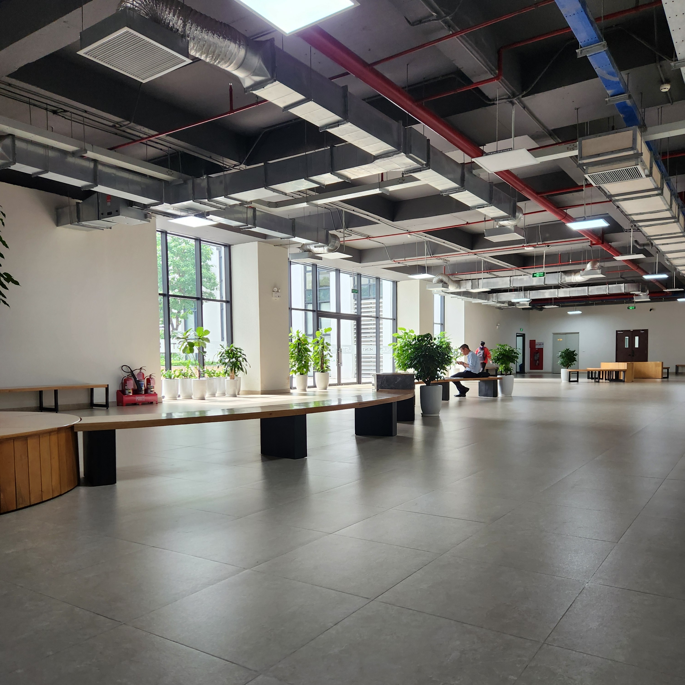

# Hall of Memories

## *Head Over Heels*

<i>PRESS ME</i>

Kì hè 2025, lần này các lớp được sắp xếp phòng học ở chung tầng 1 của tòa C7. Khá thú vị vì cùng một tầng đó có đủ lớp của nhiều khóa khác nhau. Ít thời gian giải lao ngắn ngủi, mỗi lần bước ra hành lang dường như là nhìn thấy cả quá khứ (*thầy Trung – Toán, cô Minh – Hóa, cô Hương – Eng, cô KA – of course*), hiện tại (*thầy Toàn, thầy Khôi*) và cả tương lai (*thầy Kumar*).

Khoảnh khắc ấy khiến tôi nhận ra: đôi khi, ta đang ở ngay trong một bảo tàng ký ức. Đã bao lâu rồi mình chưa đi bảo tàng nhỉ? À, từ tận ART-1133, mà hồi đó còn phải mua vé vào, giờ thì tiện thật, chẳng cần vé nữa. Chỉ cần để ý một chút, mọi thứ đã sống dậy theo cách riêng của nó.

Hành lang dài và rộng, rợp nắng tháng Bảy. Không có ánh nắng nào thật sự nhẹ nhàng, chỉ có những cuộc chia tay mà tâm hồn ta đã học cách sẵn sàng. Giống như mùa hạ, nó chẳng bao giờ đến một cách vội vã. Nó cứ hé lộ từ từ - qua tia nắng, qua hơi nóng phả lên từ mặt đường, hay ánh mắt mà ta biết sẽ không còn quay lại...

  

> Nothing in the world belongs to me  
> But my love, mine all mine all mine

TROY!!! ❤️

## *"Dường như nắng đã làm má em thêm hồng..."*

Một sớm mùa thu Hà Nội, những ánh nắng mỏng manh như tơ rắc xuống mấy con phố nhỏ làm tôi nhớ cậu, người bước vào trái tim tôi, như ánh nắng đầu tiên của buổi ban ngày, trong trẻo và ấm áp vô vàn lắm. Đi qua phố Hàng Than, hương cốm thoảng qua trong gió, quen thuộc đến mức mà tự nhủ: *"Đi học thôi mà, có cần khiến mình nhớ nhung vậy không?"*. Mùa thu nơi đây không ồn ào, chỉ lặng lẽ ôm lấy từng ánh mắt, như một bản tình ca vậy. Không biết nói thế nào để cho cậu hiểu, chỉ biết rằng những ngày trời rất đẹp, tôi luôn ước có cậu cùng đi qua. Dạo bước trên sân trường im ắng, hết kỳ rồi này… cậu đã tìm thấy mình chưa?

## 🩵

> 'Tâm trí anh còn lại  
>
> Mỗi em như đốm sáng nơi vực tối  
>
> Dìu anh qua bao nhiêu bầu trời giông tố'
